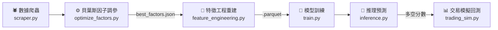

# 🇹🇼 台灣股市量化交易系統
### Taiwan Stock Quantitative Trading System

<p align="center">
  
  
  
</p>

<p align="center">
  一條龍全自動化台股量化預測系統 · LightGBM 多天期分類預測 · Optuna 貝葉斯調參 · Out-of-Sample 實戰回測
</p>

---

## 🎯 系統核心特色

> 傳統相對選股模型在「市場崩盤日」依然會滿倉買入（在全大跌日買入跌最少的股票），導致資產隨大盤沉淪。本系統透過三層防禦機制徹底解決這個問題。

### 三層絕對收益防禦架構

| 層級 | 機制 | 說明 |
|------|------|------|
| **第一層** 宏觀感知 | 辨識市場多空環境 | 注入全市場日報酬均值、市場寬度（上漲比例）與板塊趨勢強度 |
| **第二層** 混合型標籤 | 強勢股雙重門檻 | 強勢股需同時滿足：相對排名前 20% **且** 絕對報酬率 > 0%，崩盤日不產生買入標籤 |
| **第三層** 智慧空倉 | 全面信號惡化自動避險 | Day1 分數全面下滑時，系統自動判定無股可買，100% 空倉持現金 |

### 多源數據融合

| 數據來源 | 內容 |
|---------|------|
| 📊 **TWSE 證交所** | 收盤行情、三大法人買賣超、融資融券、個股與大盤本益比、殖利率 |
| 📈 **TAIFEX 期交所** | 台指期外資未平倉淨額 |
| 🏦 **TDCC 集保所** | 每週大戶持股分級比例 |
| 📋 **FinMind** | 月營收、季報（損益表、資產負債表、現金流量表）、歷年股利 |

---

## 🔄 系統工作流程



---

## ✨ 功能模組詳解

<details>
<summary><b>🕷️ 多源容錯爬蟲 (scripts/scraper.py)</b></summary>

- 整合原 `main.py`、`patch_finmind.py`、`fetch_categories.py`、`check_data.py` 入口。
- 免 Token 抓取證交所收盤行情、三大法人買賣超、融資融券、借券餘額、當沖比例、外資持股、本益比、殖利率。
- 期交所台指期外資未平倉、集保所每週大戶持股。
- 整合 FinMind 月營收與三大財務報表（支援 `FINMIND_CACHE_DAYS` 自訂天數快取，預設 15 天，可由 `config.py` 自由調校）。
- 具備失敗計數略過（`failed_dates.json`）與空值快取機制，節省 Token 與網路開銷。
- **限額智慧控制**：遭遇 API 429/402 限制時，若為全流程執行（Auto_RUN）會拋出 `FinMindLimitExceeded` 並自動跳過爬蟲不卡死流程；若為單獨執行下載（`-s d`），主控會自動改為「原地等待 1 小時重置」以確保資料抓完。

</details>

<details>
<summary><b>⚙️ 精密特徵工程 (scripts/feature_engineering.py)</b></summary>

- **技術指標**：Moving Average (MA)、KD、RSI、MACD、布林通道 (Boll)、ATR、成交量比 (Vol MA)（指標參數均可由 Optuna 最佳化）。
- **法人籌碼**：外資/投信/自營買賣超、連續買超天數、滾動累積籌碼。
- **市場感知**：全市場日報酬均值、市場寬度（上漲比例）5日/20日滾動趨勢。
- **板塊強度**：依 `scripts/stock_categories.json` 計算各產業每日平均報酬與滾動強度。
- **自動消除 Level Bias**：絕對金額轉為比例/變化率，避免模型記住個股身份。

</details>

<details>
<summary><b>🔬 貝葉斯超參數最佳化 (scripts/optimize_factors.py)</b></summary>

- 使用 Optuna TPE 框架自動搜尋技術指標最佳參數組合。
- 嚴格日期分界防止前視偏差（Lookahead Bias）。
- 支援 Early Stopping（連續 N 輪無進展自動終止）。
- 結果存至 `best_factors.json`，供後續流水線復用。

</details>

<details>
<summary><b>🤖 智能推論預測 (scripts/inference.py)</b></summary>

- 讀取最新一天資料，載入 LightGBM 模型推論未來 1~3 天多空分數。
- 自動對齊持倉清單，計算即時浮動損益（需在 `Stocks.txt` 填入成本）。
- 依交易模擬器策略參數自動輸出明日建議買進 / 賣出掛單。
- **智慧限價掛單**：自動依預測信心強度動態推薦溢價幅度（+1.5% ~ +2.5%），並對齊台灣股市報價升降單位 (Tick Size) 四捨五入，直接輸出開盤建議掛單限價，省去人工計算。
- 自動排除 ETF，優先顯示「可立即行動」的高分標的。

</details>

<details>
<summary><b>📊 實戰交易模擬器 (trading_sim.py)</b></summary>

- 模擬真實手續費（0.1425%）與證交稅（0.3%）。
- 個股固定停損（-8%）+ 信號轉弱出場雙重保護。
- 剩餘現金動態配倉（不固定每檔金額，依剩餘槽位均分）。
- **動態參數覆蓋**：支援透過 CLI 參數覆蓋大盤避險紅燈與停損門檻，以便於回測探索。
- **真實 T+2 交割機制模擬**：細分「購買力（可用資金）」與「銀行實質餘額（T+2 扣/入款）」，賣出股票當天資金可立即滾動買入，但實質款項於兩日後才完成交割。
- 支援零股交易精算，回測結束輸出多分頁 Excel 報表。

</details>

---

## 📁 目錄結構

<details>
<summary>展開查看完整目錄結構</summary>

```text
Stock/
├── 📂 data/                    # 原始 CSV、快取 JSON、特徵 Parquet
│   ├── 📂 raw_price/           # 每日收盤行情與成交量
│   ├── 📂 raw_chips/           # 籌碼面資料 (三大法人、當沖、外資持股)
│   ├── 📂 raw_margin/          # 信用交易資料 (融資融券、借券)
│   ├── 📂 raw_twse_per/        # 個股官方本益比、殖利率及淨值比
│   ├── 📂 raw_taifex/          # 期貨大盤外資多空未平倉
│   ├── 📂 raw_shareholding/    # 每週集保戶股權分散表
│   ├── 📂 raw_financial/       # FinMind 基本面財報
│   ├── 📂 features/            # 合併後的特徵 Parquet 檔案
│   ├── failed_dates.json       # 下載失敗日期快取
│   ├── no_finmind_data.json    # FinMind 空值快取
│   └── skip_dates.json         # 官方爬蟲跳過快取
├── 📂 models/                  # LightGBM 訓練模型檔 + feature_cols.json
├── 📂 reports/                 # 模擬交易績效報表 (CSV / Excel)
├── 📂 predictions/             # 每日推理結果與智慧掛單建議檔 (.txt)
├── 📂 scripts/                 # 核心演算法與處理腳本
│   ├── 📂 tools/
│   │   └── clean_stocks.py     # 自選股清單驗證與重複清理工具
│   ├── scraper.py              # 多源容錯資料爬蟲
│   ├── feature_engineering.py  # 核心特徵與標籤提取模組
│   ├── train.py                # LightGBM 多天期分類模型訓練器
│   ├── inference.py            # 多空分數預測排行榜 + 智慧限價掛單指引
│   ├── optimize_factors.py     # Optuna 貝葉斯超參數最佳化器
│   ├── optimize_trading_params.py # 交易策略與避險參數最佳化器 (Optuna TPE)
│   ├── backtest.py             # 時光機單日回測器 (樣本外評估)
│   ├── utils.py                # 全系統共享股票解析與過濾工具
│   ├── stock_categories.json   # 產業分類與 ETF 全系統共享對照表
│   └── StockSync.py            # 雲端自動備份上傳工具 (調用 rclone)
├── 📂 tests/
│   ├── test_finmind.py         # FinMind 財報單元測試
│   ├── test_pipeline.py        # 全流程整合測試 (18 項 100% PASS)
│   └── test_scraper.py         # 證交所 API 單元測試
├── Auto_RUN.py                 # 一鍵順序執行全流程主控腳本
├── auto_pipeline.py            # 一鍵式自動化流水線入口
├── config.py                   # 系統中央控制面板
├── run_workflow_experiment.py  # 一鍵全自動雙階段實驗主控腳本
├── run_workflow_experiment_guide.md # 實驗主控台使用說明與架構指南
├── trading_sim.py              # 實戰級量化模擬交易器 (回測引擎)
├── Stocks.txt                  # 自選股 / 實質持倉清單
├── best_factors.json           # 最佳化技術指標參數存檔
├── best_trading_params.json     # 最佳化交易與風控策略參數存檔
├── FINMIND_TOKEN.txt           # FinMind API 金鑰存放檔 (可選)
└── requirements.txt            # Python 依賴套件清單
```

</details>

---

## 🚀 快速開始

### Step 1 — 建立虛擬環境與安裝依賴

```powershell
python -m venv venv
.\venv\Scripts\Activate.ps1
pip install -r requirements.txt
```

### Step 2 — 設定自選股清單

編輯根目錄的 `Stocks.txt`，支援三種格式：

```text
2330          # 格式 A：僅追蹤（不計算損益）
2317,161.0    # 格式 B：有買進成本（顯示損益%）
2454,680.5,1000  # 格式 C：完整持倉（顯示損益金額）
```

> **提示**：若要爬取 FinMind 財務報表，可在根目錄建立 `FINMIND_TOKEN.txt` 並貼入 API Token（亦支援未填寫時的免費限額模式）。

### Step 3 — 系統配置設定 (config.py)

所有系統參數統一集中在 [config.py](config.py)，開始前請確認以下關鍵設定：

| 參數 | 說明 |
|------|------|
| `TRAIN_INDUSTRIES` | 加入訓練與交易的產業板塊（自選股 `Stocks.txt` 必定保留） |
| `BUY_THRESHOLD` / `SELL_THRESHOLD` / `STOP_LOSS_PCT` | 買賣策略分數與停損門檻 |
| `START_DATE` / `FINMIND_FETCH_MODE` | 爬蟲下載的時間起點與過濾模式 |
| `RUN_OPTIMIZATION` / `FEAT_N_JOBS` / `TRAIN_N_JOBS` | 最佳化開關與多核心平行核心數 |

### Step 4 — 執行

> [!NOTE]
> `--step` / `-s` 支援完整拼寫與首字簡碼，例如 `--step download`、`-s download`、`-s d` 全數等價。

#### 方案甲：一鍵主控執行（生產流程）

```powershell
python Auto_RUN.py           # 完整生產流程：下載 → 特徵/訓練 → 推理 → 備份
python Auto_RUN.py -s d      # 僅增量下載今日資料
python Auto_RUN.py -s p      # 僅重建特徵、訓練與推理
python Auto_RUN.py -s b      # 僅執行雲端備份
```

#### 方案乙：一鍵流水線執行（研發與最佳化流程）

```powershell
python auto_pipeline.py      # 完整研發流水線（Optuna 取決於 config.py 設定）
python auto_pipeline.py -s o # 單獨啟動 Optuna 調參（強制執行，無視 config.py）
python auto_pipeline.py -s f # 單獨重建特徵矩陣
python auto_pipeline.py -s t # 單獨訓練 LightGBM 模型
python auto_pipeline.py -s i # 單獨輸出今日推理結果
```

#### 方案丙：資料庫維護與補件 (scripts/scraper.py)

```powershell
python scripts/scraper.py            # 增量下載今日最新資料
python scripts/scraper.py -p 2330    # 針對特定股票補足歷史財報
python scripts/scraper.py -fc        # 重新更新全市場產業分類對照表
python scripts/scraper.py -c         # 掃描並刪除損毀或異常的歷史資料
```

#### 方案丁：實戰級量化模擬交易器 (trading_sim.py)

用於在指定歷史區間中進行 **Out-of-Sample（樣本外）資金與交易模擬**。本回測器完整模擬了真實的台股 T+2 交割機制（細分購買力與銀行實質餘額）、手續費與稅金、個股停損、移動止盈與大盤避險紅綠燈關卡。

預設參數會自動由 `config.py` 讀取，但您可以透過 CLI 參數動態覆蓋進行參數實驗：

```powershell
# 1. 以預設參數執行模擬 (預設區間: 2026-01-01 ~ 2026-06-30，初始資金: 100萬，最大持股: 5檔)
python trading_sim.py

# 2. 指定回測期間、初始資金與最大持倉上限
python trading_sim.py -s 2026-01-02 -e 2026-05-30 -c 2000000 -m 8

# 3. 實驗不同的風控與策略參數 (動態覆蓋 config.py 的預設參數)
python trading_sim.py --buy_threshold 12.0 --stop_loss -7.0 --panic_ma5 -0.008 --panic_breadth 0.25
```

**參數選項說明：**
- `-s, --start <YYYY-MM-DD>`：回測起始日期（預設值為 `SIM_DEFAULT_START`）
- `-e, --end <YYYY-MM-DD>`：回測結束日期（預設值為 `SIM_DEFAULT_END`）
- `-c, --capital <整數>`：回測初始資金（預設值為 `SIM_DEFAULT_CAPITAL`）
- `-m, --max_pos <整數>`：最大持倉上限檔數（預設值為 `MAX_POSITIONS`）
- `--panic_ma5 <浮點數>`：大盤 5 日滾動平均報酬率避險門檻（例如 `-0.010` 代表 -1.0%）
- `--panic_breadth <浮點數>`：全市場上漲比例避險門檻（例如 `0.30` 代表 30%）
- `--buy_threshold <浮點數>`：Day1 多空淨分數買入門檻百分比（例如 `10.0`）
- `--stop_loss <浮點數>`：個股固定停損百分比（例如 `-8.0`）
- `--ts_activation <浮點數>`：移動止盈啟動門檻百分比（例如 `10.0`）
- `--ts_pullback <浮點數>`：移動止盈回撤門檻百分比（例如 `-6.0`）

---

#### 方案戊：時光機樣本外單日回測器 (scripts/backtest.py)

針對**單一基準日期 (D)** 的走步驗證（Walk-forward Validation）工具。它會將時間軸限制在日期 D 之前（防止前視偏差），自動訓練 Day1~Day3 的 LightGBM 分類模型，並直接在 D 之後的 3 個交易日上執行預測，輸出真實命中率。

```powershell
# 語法：python scripts/backtest.py <YYYYMMDD 或 YYYY-MM-DD>
python scripts/backtest.py 2025-08-01
```

**回測產出說明：**
- 輸出 Day1 ~ Day3 全市場預測方向勝率與嚴選 Top-20 (或 Top-3) 強勢股的命中率與平均獲利。
- 自動加載 `Stocks.txt` 自選股，將其在該基準日產生的多空分數、預測漲跌、實際漲跌與方向預測結果完整以表格對比印出。

---

#### 方案己：交易策略與避險參數自動調參器 (scripts/optimize_trading_params.py)

利用 Optuna 的 TPE 貝葉斯最佳化演算法，在歷史訓練資料上自動搜尋最佳的避險與交易策略參數組合。本腳本採用**多市況魯棒性交叉驗證（Regime-Robust CV）**機制，將回測期依時間順序切分為 3 個子區間（如：2021多頭、2022空頭、2023-2025多空震盪），分別計算各區間的 Calmar 比率：
* **若所有區間回報皆為正**：目標得分採用**調和平均值（Harmonic Mean）**，對任何單一表現差勁的區間進行重度懲罰。
* **若有任何區間回報為負**：目標得分採用**最小值（Minimin）**，強制避開在空頭市場崩盤或震盪市中爆倉的配置。

這能有效防止調參器因為單一「超級大牛市」的利潤而過度擬合出過於激進的策略，尋找出真正抗震、全天候的「黃金風控配置」。

##### 1. 執行方式與參數說明

本指令支援**簡寫（Short options）**與**完整長參數（Long options）**，且所有參數均有基於 `config.py` 的預設值：

*   **預設執行**（讀取 `config.py` 中的 `OPTIMIZATION_TRIALS` 作為搜尋輪數，預設為 600 輪；結束時間為 `BACKTEST_DATE`，起始時間為截止日往回推 2.5 年，初始資金 1,000,000 元）：
    ```powershell
    python scripts/optimize_trading_params.py
    ```

*   **指定簡短參數執行**（搜尋 150 輪，從 2021-01-01 開始，2025-08-01 結束，初始資金 200 萬）：
    ```powershell
    python scripts/optimize_trading_params.py -t 150 -s 2021-01-01 -e 2025-08-01 -c 2000000
    ```

*   **指定長參數執行**（效果與上方簡短參數完全相同）：
    ```powershell
    python scripts/optimize_trading_params.py --trials 150 --start 2021-01-01 --end 2025-08-01 --capital 2000000
    ```

##### 2. 命令列參數清單

| 短參數 | 長參數 | 類型 | 預設值 | 說明 |
| :--- | :--- | :--- | :--- | :--- |
| `-t` | `--trials` | `int` | `config.py` 中的 `OPTIMIZATION_TRIALS` (目前為 600) | 最佳化搜尋的總迭代輪數。 |
| `-s` | `--start` | `str` | `BACKTEST_DATE` 往回推 2.5 年 | 模擬交易起始日期 (`YYYY-MM-DD`)。 |
| `-e` | `--end` | `str` | `config.py` 中的 `BACKTEST_DATE` (目前為 `2025-08-01`) | 模擬交易結束日期 (`YYYY-MM-DD`)。 |
| `-c` | `--capital`| `int` | `1000000` | 模擬交易的起始資金。 |
| `-m` | `--max_pos`| `int` | `config.py` 中的 `MAX_POSITIONS` (目前為 5) | 同時持股的最大檔數限制。 |
| `-j` | `--jobs` | `int` | `1` | 並行線程數 (交易模擬包含I/O與複雜邏輯，建議設為 `1`)。 |

##### 3. 輸出結果與自動套用

搜尋完成後，最佳參數與回測指標會自動輸出並覆蓋存檔於 `best_trading_params.json`。該檔案除了包含最佳的參數配置外，還會記錄**全區間整體績效**與**三個子區間個別的報酬率、最大回撤與得分**，供後續分析。

`config.py` 在被任何模組（回測、模擬、推理）載入時，會自動偵測並讀取此 JSON 檔，動態覆寫內部的風控參數，使新參數立刻全系統生效。

---

> [!WARNING]
> #### ☁️ rclone 雲端備份注意事項
>
> 1. **執行檔需另行下載**：前往 [rclone 官網](https://rclone.org/downloads/) 下載 `rclone.exe`，放入 `venv/Scripts/` 或加入系統 PATH。
> 2. **金鑰安全**：`rclone config` 產生的金鑰已列入 `.gitignore` 與 `.agyignore`，**絕對禁止提交至 Git 倉庫或外洩**。

### Step 5 — 雙階段參數最佳化研發流程（調參工作流）

為了讓系統在實戰中達到最優表現，本專案設計了**因子最佳化**與**風控最佳化**的雙階段調參架構：

1. **第一階段：技術指標與因子最佳化 (Optimize Factors)**
   - **目的**：搜尋最適合目前選定板塊與自選股的技術指標週期參數（如均線長短、RSI/KD天數等），使機器學習模型預測最準確。
   - **執行指令**：`python auto_pipeline.py -s o`
   - **產出**：儲存最佳技術指標參數至 `best_factors.json`。
   - **後續步驟**：執行特徵重建 `python auto_pipeline.py -s f` 與模型重新訓練 `python auto_pipeline.py -s t`，以將新因子應用到特徵數據與模型中。

2. **第二階段：交易策略與避險風控最佳化 (Optimize Trading Params)**
   - **目的**：在模型預測力固定下，搜尋最佳的實戰交易風控參數（如個股停損線、大盤避險紅燈、移動止盈啟動線），以最大化獲利率並抑制最大回撤 (MDD)。
   - **執行指令**：`python scripts/optimize_trading_params.py`
   - **產出**：儲存最佳風控與策略參數至 `best_trading_params.json`。
   - **後續步驟**：此結果會由 `config.py` 在初始化時自動動態加載並覆寫預設常數，**全系統（回測、模擬、推理）將立即自動套用新風控值**，無須任何手動操作。

### Step 6 — 量化研發與實盤生產工作流 (模式 A 與 模式 B)

本系統將量化流程嚴格區分為**「模式 A：研究與策略驗證」**（以 2025-08-01 為界）與**「模式 B：實盤生產推理」**（動態滾動重訓）兩種運行模式。這種設計能有效防止過擬合與前視偏差，並在實盤時快速吸收最新市場特徵。

---

#### 1. 核心診斷與調參工具的定位、意義與執行時機

本系統配備了兩個重要的研發工具，分別負責「訊號層」的診斷與「執行層」的優化：

##### 🩺 訊號診斷器：`scripts/analyze_regime_stability.py`
*   **存在的意義（Why）**：
    機器學習模型（LightGBM）的預測力基於歷史特徵分佈。當市場從兩萬點暴漲至四萬點時（發生 **Regime Shift**，市場狀態轉變），原本有用的因子（例如均值回歸特徵）可能反轉為動量特徵，或者特徵數值分佈發生劇烈漂移。本工具專門計算 **RankIC、選股單調性（Monotonicity）、特徵漂移度（PSI）以及相關性漂移**，用來回答：*「模型目前的選股排序能力是否依然健康？是否發生因子失效？」*
*   **何時執行與目的（When & Goal）**：
    *   **在模式 A（研究期）中**：當您剛完成因子與模型訓練，準備評估其在「樣本外（OOS）超級牛市」中的表現時執行。目的在於驗證模型在**完全沒看過的市況下**是否仍具備選股超額收益（Alpha）。如果 OOS RankIC 依然顯著為正，說明模型底層邏輯健康。
    *   **在模式 B（實盤期）中**：**每隔一個月，或當大盤發生重大暴跌、風格轉換時**手動執行。目的在於監控實盤運作中特徵漂移（PSI）是否超標。若 PSI >= 0.25 且 RankIC 顯著衰退，則代表需要回到模式 A 重新篩選或設計因子，而不是盲目重訓。

##### 🎛️ 策略優化器：`scripts/optimize_trading_params.py`
*   **存在的意義（Why）**：
    交易執行層的風控參數（如個股停損、大盤避險紅燈、移動止盈）若只在單一市場狀態下測試，極易擬合出極端參數。例如：在熊市中停損過緊會導致頻繁被洗出場，在大牛市中避險過度敏感則會導致嚴重少賺。本工具採用 **Regime-Robust CV（多市況交叉驗證）**，以 `Score = Return - 2.0 * MDD` 的調和平均或最小值為指標，藉由 Optuna 貝葉斯尋優，找出能跨越不同市場週期的黃金風控配置。
*   **何時執行與目的（When & Goal）**：
    *   **在模式 A（研究期）中**：在用 `analyze_regime_stability.py` 診斷模型訊號健康後執行。**優化區間的結束時間必須鎖在 2025-08-01 之前**（例如 `-s 2021-01-02 -e 2025-08-01`），絕對不能讓 Optuna 偷看 2025-08-01 之後的超級牛市。目的是找出在歷史市況下的最優風控，然後在未知的樣本外（OOS）超級牛市上做回測，檢驗這組參數的泛化防禦力。
    *   **在模式 B（實盤期）中**：在正式實盤上線前，或當市場經歷了大段未知市況（如 2025-08 ~ 2026-06 這段牛市）時執行一次**全週期（包含這段牛市）的優化**（例如 `-s 2023-01-01 -e 2026-06-01`）。目的是將這段高波動、高回報的全新市況納入 Optuna 的優化區間。避免優化器因為沒見過牛市的大波動，而擬合出過度保守的避險參數（例如過早觸發避險空倉或停損過緊），導致策略在實盤牛市中因頻繁停損或避險空倉而嚴重少賺。

---

#### 2. 🟢 模式 A：研究與策略驗證期 (Researcher Mode)

*   **配置設定**：確認 [config.py](config.py) 中的 `BACKTEST_DATE = "20250801"`。
*   **核心目的**：刻意保留 2025-08-01 至 2026-06-05 這段長達 10 個月、橫跨兩萬多點到四萬多點的超級牛市，作為**「模型完全沒看過的樣本外（OOS）乾淨測試集」**。在此模式下，您可以反覆調整因子與風控，並在 OOS 區間驗證策略防禦力。
*   **工作流與執行步驟（含為什麼這樣做）**：
    1.  **增量更新原始數據**：
        ```powershell
        python Auto_RUN.py --step download
        ```
    2.  **因子技術指標尋優**：
        ```powershell
        python auto_pipeline.py -s o
        ```
        *   *為什麼*：使用 Optuna 尋找最適合指定產業的技術指標參數（如均線窗口、KD週期），產生 `best_factors.json`。
    3.  **重建特徵工程與訓練模型**：
        ```powershell
        python auto_pipeline.py -s f
        python auto_pipeline.py -s t
        ```
        *   *為什麼*：模型訓練會嚴格截斷在 2025-08-01 之前，確保模型不會有前視偏差。
    4.  **訊號層健康診斷**（`analyze_regime_stability.py`）：
        ```powershell
        python scripts/analyze_regime_stability.py
        ```
        *   *為什麼*：評估模型在 2025-08-01 之後 OOS 超級牛市中的 RankIC 與 Alpha。如果 RankIC > 0.02 且 Top 1% Alpha 依然顯著，代表模型選股排序能力極佳，可以進入策略調參；否則需重新設計特徵。
    5.  **交易風控參數優化**（`optimize_trading_params.py`）：
        ```powershell
        python scripts/optimize_trading_params.py -s 2021-01-02 -e 2025-08-01 -c 2000000
        ```
        *   *為什麼*：搜尋結束日期必須鎖在 2025-08-01。讓 Optuna 在歷史多空震盪環境中優化出風控參數（如 `stop_loss = -8.0%`），不讓它偷看未來的超級牛市。
    6.  **樣本外（OOS）模擬交易回測**（`trading_sim.py`）：
        ```powershell
        python trading_sim.py --start 2025-08-02 --end 2026-06-05 -c 2000000
        ```
        *   *為什麼*：使用步驟 5 優化出的 `best_trading_params.json`，在完全沒看過的 OOS 超級牛市區間執行模擬交易。如果此時的 Return 與 MDD（Return - 2.0*MDD）依然非常優異，代表整個量化系統的泛化能力極強，即可準備進入實盤。

---

#### 3. 🔵 模式 B：實盤生產推理期 (Production & Live Mode)

當策略在模式 A 通過嚴格的樣本外驗證，準備每日獲取最新下單建議與部位管理時切換為此模式。

*   **配置設定**：修改 [config.py](config.py) 中的 `BACKTEST_DATE = None`。
*   **核心目的**：
    *   在實盤生產中，大盤已經到了四萬點，個股股價與成交量級別與兩萬點時截然不同。如果模型依然只用 2025-08-01 之前的舊數據訓練，將無法識別 2025-08 ~ 2026-06 這段牛市新出現的因子特徵（如高價股與權值股的飆升型態），導致預測力大幅衰退。
    *   因此，設為 `None` 後，系統會將訓練邊界改為**每日動態滾動（例如使用最新一天往前推 2.5 年）**，使模型每天都能吸收最新的市場知識。
*   **日常運作與工作流**：
    1.  **實盤上線前/定期執行風控優化**：
        ```powershell
        python scripts/optimize_trading_params.py -s 2023-01-01 -e 2026-06-01 -c 2000000
        ```
        *   *為什麼*：在進入實盤前，必須把 2025-08 ~ 2026-06 這段大牛市納入 Optuna 的優化區間。這樣優化器才能見識到牛市的真實波動度，優化出一套適合當下高點行情的「黃金風控配置」，避免因為避險過度敏感而在實盤中被震盪洗出場或錯失行情。
    2.  **每日收盤後執行一鍵主控**（通常在 15:30 三大法人資料更新後）：
        ```powershell
        python Auto_RUN.py
        ```
        *   *為什麼*：這會一鍵自動完成所有生產流程：增量下載當日數據 -> 依據最新數據滾動重訓最新模型 -> 載入最新風控參數並推理出明日具體掛單建議 -> 調用 rclone 自動備份預測報告至 Google Drive，讓您可以用手機即時查看明日開盤買賣掛單。

---

#### 4. 🎛️ 一鍵全自動雙階段實驗腳本 ([run_workflow_experiment.py](run_workflow_experiment.py))

如果您希望一鍵自動執行模式 A 與模式 B 的所有研發步驟（包括因子調參、特徵工程、模型重訓、訊號診斷、策略調參和模擬交易），而不需要手動干預或等待，我們提供了一個一鍵式實驗控制腳本 [run_workflow_experiment.py](run_workflow_experiment.py)。

本腳本會在運行前自動備份您的中央配置 [config.py](config.py) 與歷史參數，並在執行結束後（不論成功或失敗）**百分之百 safe 還原**，不影響您的實盤日常生產環境。

##### ① 執行方式與參數
```powershell
# 1. 預設執行 (因子調參跑 30 輪，風控調參跑 100 輪，初始資金 200 萬，重新執行因子尋優)
python run_workflow_experiment.py

# 2. 自訂調參輪數與資金 (模式 A 因子調參 50 輪，風控調參 150 輪，初始資金 300 萬)
python run_workflow_experiment.py -f 50 -t 150 -c 3000000

# 3. 沿用現有 best_factors.json (跳過因子優化，僅重新訓練模型與優化交易風控，速度最快)
python run_workflow_experiment.py --skip_factor_opt
```

##### ② 實驗產出報告與備份存檔
執行完畢後，系統會自動在 `reports/` 目錄生成一份詳細的 Markdown 對比報告 [reports/workflow_experiment_report.md](reports/workflow_experiment_report.md)，其中包含：
*   **關鍵績效指標對比**：模式 A（樣本外超級牛市）與模式 B（全週期含牛市）的區間報酬、最大回撤 (MDD) 與 Calmar 比率對比。
*   **最佳化風控參數對比**：展示 Optuna 在兩模式下搜尋出的黃金參數差異（如大盤避險紅燈、個股停損線的漂移）。
*   **獨立存檔參數與診斷**：
    *   模式 A 訊號診斷報告存檔於 [reports/mode_a_regime_stability_report.txt](reports/mode_a_regime_stability_report.txt)。
    *   模式 A 風控參數存檔於 `best_trading_params_mode_a.json`。
    *   模式 B 風控參數存檔於 `best_trading_params_mode_b.json`。

---

### Step 7 — 執行系統整合測試

在提交程式碼或更動主要演算法前，請確保 18 項關鍵整合測試 100% 通過：

```powershell
python tests/test_pipeline.py
```

---

## ⚙️ 核心策略參數

| 參數 | 預設值 | 說明 |
|------|--------|------|
| `BUY_THRESHOLD` | `10.0%` | Day1 多空淨分數達此值才觸發買進 |
| `SELL_THRESHOLD` | `0.0%` | Day3 多空淨分數低於此值觸發賣出 |
| `STOP_LOSS_PCT` | `-8.0%` | 相對買進成本的個股固定停損線 |
| `MKT_PANIC_MA5` | `-1.0%` | 大盤 5 日滾動平均報酬率避險紅燈門檻 |
| `MKT_PANIC_BREADTH` | `30.0%` | 全市場上漲家數比例避險紅燈門檻 |
| `MAX_POSITIONS` | `5 檔` | 最大同時持股數 |
| `FEE_RATE` | `0.1425%` | 單邊券商手續費 |
| `TAX_RATE` | `0.3%` | 賣出證交稅（非當沖） |
| **總交易摩擦成本** | **≈ 0.585%** | 模型選股獲利需超越此值才有淨利 |

---

## 📈 回測架構說明


> **Out-of-Sample 保證**：模型訓練截止於 `2025-08-01`（由 `config.py` 中的 `BACKTEST_DATE` 設定），此日期後的模擬交易與回測均屬完全樣本外，無前視偏差問題。

---

## 🛡️ 開發與提交規範

- **中央設定檔**：所有常數與 ML 配置均在 [config.py](config.py) 修改，禁止在模組腳本中硬編碼。
- **新增特徵**：修改 `feature_engineering.py` 後，必須執行 `auto_pipeline.py -s f` 重建 parquet 並重新訓練。
- **編輯自選股**：直接修改 `Stocks.txt`，可用 `python scripts/tools/clean_stocks.py` 自動清理重複代碼。
- **提交前**：務必執行 `python tests/test_pipeline.py` 確認全數通過。

---

## 📄 免責聲明

本系統所有預測結果與回測報告僅供量化研究參考，**不構成任何實際投資建議**。投資涉及風險，請自行審慎評估。
