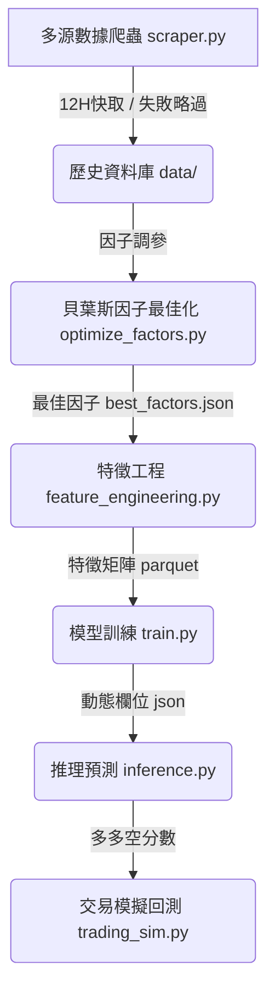

# 📈 台灣股市量化交易系統 (Taiwan Stock Quantitative Trading System)

[](https://www.python.org/downloads/)
[](https://lightgbm.readthedocs.io/)
[](https://optuna.org/)
[](https://opensource.org/licenses/MIT)

這是一個**一條龍全自動化、具備宏觀避雷與絕對收益防禦機制**的台股量化預測與模擬交易系統。本系統採用 LightGBM 多天期分類預測模型，融合證交所（TWSE）、期交所（TAIFEX）、集保所（TDCC）多源大數據以及 FinMind 基本面資料，並透過 Optuna 進行貝葉斯因子超參數最佳化，最終在 Out-of-Sample（樣本外）實戰模擬器中產出高質量的回測與投資決策。

---

## 🌟 核心亮點：實戰級別「絕對收益避雷系統」

傳統相對選股模型在「市場崩盤日」依然會滿倉買入（例如在全大跌日買入跌最少的股票），導致資產隨大盤一同沉淪。本系統在特徵與標籤工程上進行了實戰級別的重大升級：

1. **大盤與板塊趨勢感知 (方案 B)：** 
   特徵工程自動注入「全市場日報酬平均」及「市場寬度（上漲比例）」，並計算 5日/20日 滾動趨勢。同時根據 `stock_categories.json` 計算各產業板塊（如半導體、光電、航運）的每日平均表現與滾動強度，給予模型宏觀視野。
2. **絕對與相對混合型標籤 (方案 C)：** 
   標籤設計強制規定強勢股（`Label=2`）除滿足相對排名前 20% 外，**未來絕對報酬率必須大於 0.0%**；弱勢股（`Label=0`）則為相對後 20% 或絕對跌幅超過 `-2.0%`。
3. **崩盤日智慧空倉避險：** 
   上述兩者與交易模擬器（`trading_sim.py`）的買入分數門檻（預設 `Day1_score >= 10.0%`）相輔相成。在大盤大跌日，全市場多空分數會自適應下滑，系統會**自動判定無股可買而 100% 空倉持有現金避險**，完美避開系統性崩盤！

---

## 🚀 核心流水線工作流 (Workflow)



---

## 🛠️ 核心功能清單

* **🕷️ 多源容錯爬蟲 (`scraper.py`)**：免 Token 抓取證交所收盤行情、三大法人買賣超、融資融券、借券餘額、當沖比例、外資持股、本益比、殖利率；期交所台指期外資未平倉；集保所每週大戶持股。整合 FinMind 月營收與三大財務報表。具備失敗計數略過（`failed_dates.json`）與空值快取機制，大幅節省 Token 與網路開銷。
* **🧬 精密特徵工程 (`feature_engineering.py`)**：動態計算 Moving Average、KD、RSI、MACD、布林通道與 ATR 技術指標，自動消除 Level Bias（層級偏差），融合法人籌碼、信用交易、大戶持股與宏觀市場寬度特徵。
* **🤖 貝葉斯超參數最佳化 (`optimize_factors.py`)**：利用 Optuna 框架在 strict 日期分界（避免偷看未來）的驗證集上，自動迭代尋找勝率最高的技術指標參數組合。
* **💼 實戰級交易模擬器 (`trading_sim.py`)**：模擬真實交易手續費（0.1425%）與證交稅（0.3%），具備個股固定停損（-8%）、信號轉弱出場、剩餘現金動態配倉等實戰風控。日終統一對齊 `Current_Cash`、`Stock_Value` 與 `Total_Equity`。
* **🛠️ 共享工具與測試套件 (`utils.py` & `tests/`)**：統一 `Stocks.txt` 的解析標準（自動識別代碼或成本對應），並在 `tests/` 下建立了 19 項 100% PASS 的單元與整合測試防禦網，保障系統重構的穩定性。

---

## 📂 目錄結構

```text
D:\VScode_Stock\Stock
├── data/                       # 原始歷史資料 CSV、快取 JSON 與特徵矩陣 Parquet
├── models/                     # 訓練好的 LightGBM 模型檔及 feature_cols.json
├── reports/                    # 交易模擬器輸出的 Excel/CSV 績效明細報表
├── scripts/
│   ├── check_data.py           # 資料完整性修復工具
│   ├── feature_engineering.py  # 核心特徵與標籤提取模組
│   └── scraper.py              # 多源容錯資料爬蟲模組
├── tests/
│   ├── test_finmind.py         # FinMind 財報單元測試
│   ├── test_pipeline.py        # 全系統流程整合測試
│   └── test_scraper.py         # 證交所 API 單元測試
├── AGENTS.md                   # AI 導航與深入架構指南
├── auto_pipeline.py            # 一鍵式自動化調參-訓練-推理流水線
├── backtest.py                 # 時光機單日回測器
├── fetch_categories.py         # 產業分類下載器
├── inference.py                # 未來多空分數排行榜推理工具
├── main.py                     # 全市場資料下載入口
├── optimize_factors.py         # Optuna 參數最佳化器
├── patch_finmind.py            # FinMind 個股缺失修補器
├── README.md                   # 本說明文件
├── requirements.txt            # 環境依賴套件清單
├── Stocks.txt                  # 自選股清單（支援代號或 代號,買進成本 格式）
├── trading_sim.py              # 實戰量化模擬交易器
└── utils.py                    # 全系統共享股票解析工具
```

---

## 🏃 快速開始使用

### 1. 安裝依賴環境
本系統建議使用 Python 3.10 以上版本，並建立虛擬環境（venv）：
```powershell
python -m venv venv
.\venv\Scripts\Activate.ps1
pip install -r requirements.txt
```

### 2. 設定自選股與 API 密鑰（可選）
* 在根目錄修改 `Stocks.txt`，填入您想追蹤的股票。支持兩種格式：
  ```text
  # 格式 A: 僅代號
  2330
  # 格式 B: 代號,買進成本（用於在預測排行榜上計算未實現損益）
  2317,161.0
  ```
* 若要抓取基本面財務報表，建議在根目錄建立 `FINMIND_TOKEN.txt` 並貼入您的 FinMind API Token（亦可使用免費免登入額度）。

### 3. 一鍵啟動全自動流水線
直接執行 `auto_pipeline.py`，系統將全自動依次執行：**Optuna 超參調優 ➔ 自動套用參數 ➔ 重建特徵與標籤 ➔ 重新訓練 3 天期分類模型 ➔ 輸出推理預測排行榜**：
```powershell
python auto_pipeline.py
```

### 4. 運行實戰模擬交易回測
當您訓練好模型後，可以使用 `trading_sim.py` 來檢驗策略在任意區間的表現，回測結束後會自動在 `reports/` 生成多分頁的高規格 Excel 績效報表：
```powershell
# 回測 2025 全年，初始資金 50 萬，最大持股 5 檔
python trading_sim.py --start 2025-01-02 --end 2025-12-30 --capital 500000 --max_pos 5
```

### 5. 執行系統測試套件
若您修改了系統特徵工程或優化了代碼，可以直接執行測試套件，確保 19 項整合指標均為綠燈：
```powershell
python tests/test_pipeline.py
```

---

## 📝 開發者與 AI 開發說明

如果您是 **AI Agent** 或者希望深入底層二次開發，請優先閱讀根目錄的 **[AGENTS.md](file:///D:/VScode_Stock/Stock/AGENTS.md)** 導航指南，該文件詳細記載了資料結構、特徵欄位命名規則、快取排除邏輯以及底層 API 的運作機制。
