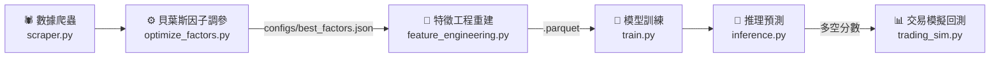

# 🇹🇼 台灣股市量化交易系統
### Taiwan Stock Quantitative Trading System

<p align="center">
  
  
  
</p>

<p align="center">
  一條龍全自動化台股量化預測系統 · LightGBM 多天期分類預測 · Optuna 貝葉斯調參 · Out-of-Sample 實戰回測
</p>

---

## ⚡ 日常操作速查

> 不熟系統架構也能用。找到你的情境，照著跑就對了。

### 🗓️ 每天 / 每週 / 定期要做什麼

| 頻率 | 做什麼 | 指令 |
| :--- | :--- | :--- |
| **每天** 收盤後（約 15:40） | 下載資料 → 重訓模型 → 產生明日掛單建議 → 備份 | `python Auto_RUN.py` |
| **每週** | 檢查模型訊號是否仍健康（RankIC / PSI） | `python scripts/analyze_regime_stability.py` |
| **每季**（3 個月） | 輕量重訓（跳過因子調參，直接重建特徵與模型） | `python run_workflow_experiment.py --skip_factor_opt --fresh` |
| **每年 / 重大事件後** | 完整重訓（含重新搜尋最佳技術指標） | `python run_workflow_experiment.py --fresh` |

---

### 📡 每天跑完 Auto_RUN.py 後，看 inference 輸出的這一行

```
[市況過濾器] regime=Bull | 買入門檻=5.0% | 動能混合: ✅ 啟用 (連續第 3 天)
```

| 動能混合顯示 | 意思 | 系統行為 |
| :--- | :--- | :--- |
| `✅ 啟用` | 牛市確認，動能排序開啟 | 選股 = 30% 模型分 + 70% 相對強度 |
| `⏳ 確認中 (N/3 天)` | 剛進牛市，等待確認 | 純模型分排序，保守選股 |
| `❌ 關閉` | 非牛市 | 純模型分排序，門檻自動提高 |

明日掛單建議在 `predictions/prediction_<日期>.txt`。

---

### 🔬 想重新搜尋更好的技術指標因子

**前提**：確認 `config.py` 中 `BACKTEST_DATE = "20250801"`（模式 A）

```powershell
python auto_pipeline.py -s o   # 搜尋最佳指標參數（可從上次結果暖啟動）
python auto_pipeline.py -s f   # 用新因子重建特徵
python auto_pipeline.py -s t   # 重訓模型
python trading_sim.py --start 2025-08-02 --end 2026-06-18 -c 2000000  # OOS 驗證
```

**判斷結果**：

| OOS 結果 vs 基準（+90.78% / MDD -18.50%） | 決策 |
| :--- | :--- |
| 報酬更高 且 MDD 沒有明顯惡化 | 保留新 `configs/best_factors.json` |
| 沒有改善 或 MDD 更大 | 還原舊 `best_factors.json`，維持現狀 |

> 💡 **自動備份與還原**：在執行因子最佳化 `python auto_pipeline.py -s o` 前，系統會自動將舊的 `best_factors.json` 備份為 `best_factors.json.bak`。若需還原舊設定，請依您的終端機類型執行對應指令：
>   * **PowerShell**: `Copy-Item configs/best_factors.json.bak configs/best_factors.json`
>   * **CMD**: `copy configs\best_factors.json.bak configs\best_factors.json /y`
>   * ⚠️ **重要提醒**：覆蓋還原 `best_factors.json` 後，**必須重新執行以下指令**以重製硬碟上的特徵矩陣與模型檔：
>     ```powershell
>     python auto_pipeline.py -s f   # 用舊因子重新計算並覆寫特徵
>     python auto_pipeline.py -s t   # 用舊特徵重新訓練並覆寫模型
>     ```
>     若不重新執行，系統磁碟中的特徵矩陣（`features_combined.parquet`）與模型仍會維持新（較差）因子的狀態，導致還原失敗。

> ⚠️ `Auto_RUN.py` 每天自動跑的因子優化（模式 B）評估窗口含近期牛市，分數天然偏高，**不能拿來跟上面的 OOS 數字比較**。

---

### 🚨 週報（analyze_regime_stability.py）看到這些要注意

| 指標 | 警告門檻 | 動作 |
| :--- | :--- | :--- |
| 60日滾動 RankIC | < 0.020 且連續下滑 | 🟡 加強監控，下週再確認 |
| OOS RankIC | < 0.015 | 🟡 加強監控 |
| PSI（特徵漂移） | > 0.25 | 🟡 加強監控 |
| OOS RankIC | < 0（連續兩週） | 🔴 本週內跑 `run_workflow_experiment.py --skip_factor_opt --fresh` |
| Mode A OOS 回測報酬 | < 0% | 🔴 本週內跑完整重訓 |
| Stage C 下界報酬 | < -5% | ⛔ 立即暫停實倉，等重訓完再說 |

---

### 🔁 重訓完後必做兩件事

```powershell
# 1. 套用最新風控參數
Copy-Item configs\best_trading_params_mode_b.json configs\best_trading_params.json -Force

# 2. 驗證 Stage C 下界仍 > 0%（跑不到正報酬就別投真錢，先 paper trading）
python trading_sim.py --start 2025-08-02 --end 2026-06-18 -c 2000000
```

---

### 📊 目前系統績效基準（2026-06-21 更新）

| 測試期間 | 報酬 | 最大回撤 |
| :--- | :--- | :--- |
| 完整 OOS（2025-08-02 ～ 2026-06-18） | **+90.78%** | -18.50% |
| 2025 全年崩盤壓測（含 4 月關稅衝擊） | **+19.41%** | -16.07% |
| Dec 2025 ～ Jun 2026（牛市段） | **+62.15%** | -15.17% |
| 2024 全年 | **+44.71%** | -23.79% |

> 模型特徵：86 個（含 `beta_60d`、`pct_from_52w_high`）。訓練截止 2025-08-01。

---

## 🎯 系統核心特色

> 傳統相對選股模型在「市場崩盤日」依然會滿倉買入（在全大跌日買入跌最少的股票），導致資產隨大盤沉淪。本系統透過三層防禦機制徹底解決這個問題。

### 三層絕對收益防禦架構

| 層級 | 機制 | 說明 |
|------|------|------|
| **第一層** 宏觀感知 | 辨識市場多空環境 | 注入全市場日報酬均值、市場寬度（上漲比例）與板塊趨勢強度 |
| **第二層** 混合型標籤 | 強勢股雙重門檻 | 強勢股需同時滿足：相對排名前 20% **且** 絕對報酬率 > 0%，崩盤日不產生買入標籤 |
| **第三層** 智慧空倉 | 全面信號惡化自動避險 | Day1 分數全面下滑時，系統自動判定無股可買，100% 空倉持現金 |
| **第四層** 市況過濾器 | 趨勢市進攻、震盪市防守 | 依昨日大盤趨勢 (10日均報酬) 動態切換買入門檻：多頭低門檻積極進場、震盪盤整高門檻防守、空頭實質空倉。解決靜態門檻「多頭少賺、震盪爆倉」的兩難 |

### 多源數據融合

| 數據來源 | 內容 |
|---------|------|
| 📊 **TWSE 證交所** | 收盤行情、三大法人買賣超、融資融券、個股與大盤本益比、殖利率 |
| 📈 **TAIFEX 期交所** | 台指期外資未平倉淨額 |
| 🏦 **TDCC 集保所** | 每週大戶持股分級比例 |
| 📋 **FinMind** | 月營收、季報（損益表、資產負債表、現金流量表）、歷年股利 |

---

## 🔄 系統工作流程



---

## ✨ 功能模組詳解

<details>
<summary><b>🕷️ 多源容錯爬蟲 (scripts/scraper.py)</b></summary>

- 整合原 `main.py`、`patch_finmind.py`、`fetch_categories.py`、`check_data.py` 入口。
- 免 Token 抓取證交所收盤行情、三大法人買賣超、融資融券、借券餘額、當沖比例、外資持股、本益比、殖利率。
- 期交所台指期外資未平倉、集保所每週大戶持股。
- 整合 FinMind 月營收與三大財務報表（支援 `FINMIND_CACHE_DAYS` 自訂天數快取，預設 15 天，可由 `config.py` 自由調校）。
- 具備失敗計數略過（`failed_dates.json`）與空值快取機制，節省 Token 與網路開銷。
- **限額智慧控制**：遭遇 API 429/402 限制時，若為全流程執行（Auto_RUN）會拋出 `FinMindLimitExceeded` 並自動跳過爬蟲不卡死流程；若為單獨執行下載（`-s d`），主控會自動改為「原地等待 1 小時重置」以確保資料抓完。

</details>

<details>
<summary><b>⚙️ 精密特徵工程 (scripts/feature_engineering.py)</b></summary>

- **技術指標**：Moving Average (MA)、KD、RSI、MACD、布林通道 (Boll)、ATR、成交量比 (Vol MA)（指標參數均可由 Optuna 最佳化）。
- **多週期動能特徵**：`ret{w}`（多週期報酬率）、`RS_{w}d`（個股相對大盤強弱）、`up_days_5`（5日上漲天數），週期由 `config.py` 的 `MOMENTUM_WINDOWS` 控制（預設 `[3, 10, 20]`）。修改週期後需重跑 `auto_pipeline.py -s f` 重建特徵。
- **市場敏感度特徵**（2026-06-20 新增，84→**86 特徵**）：`beta_60d`（60 日滾動 Beta vs 大盤，Beta>1=高敏感動能股、Beta<1=防禦股，clip ±5）、`pct_from_52w_high`（距 52 週高點距離，接近高點 = 強動能確認）。重訓後選股更精準抓高 Beta 動能股，對大盤走強的敏感度大幅提升。
- **法人籌碼**：外資/投信/自營買賣超、連續買超天數、滾動累積籌碼。
- **市場感知**：全市場日報酬均值、市場寬度（上漲比例）5日/20日滾動趨勢。
- **板塊強度**：依 `scripts/stock_categories.json` 計算各產業每日平均報酬與滾動強度。
- **自動消除 Level Bias**：絕對金額轉為比例/變化率，避免模型記住個股身份。

</details>

<details>
<summary><b>🔬 貝葉斯超參數最佳化 (scripts/optimize_factors.py)</b></summary>

- 使用 Optuna TPE 框架自動搜尋技術指標最佳參數組合。
- 嚴格日期分界防止前視偏差（Lookahead Bias）。
- 支援 Early Stopping（連續 N 輪無進展自動終止）。
- 結果存至 `configs/best_factors.json`，供後續流水線復用。

</details>

<details>
<summary><b>🤖 智能推論預測 (scripts/inference.py)</b></summary>

- 讀取最新一天資料，載入 LightGBM 模型推論未來 1~3 天多空分數。
- 自動對齊持倉清單，計算即時浮動損益（需在 `Stocks.txt` 填入成本）。
- 依交易模擬器策略參數自動輸出明日建議買進 / 賣出掛單。
- **智慧限價掛單**：自動依預測信心強度動態推薦溢價幅度（+1.5% ~ +2.5%），並對齊台灣股市報價升降單位 (Tick Size) 四捨五入，直接輸出開盤建議掛單限價，省去人工計算。
- **即時市況狀態顯示**：每次推理結束後印出目前 regime（Bull/Sideways/Bear）、有效買入門檻，以及動能混合排序狀態（`✅ 啟用` / `⏳ 確認中 N/3 天` / `❌ 關閉`），讓使用者一眼掌握今日選股邏輯。
- 自動排除 ETF，優先顯示「可立即行動」的高分標的。

</details>

<details>
<summary><b>📊 實戰交易模擬器 (trading_sim.py)</b></summary>

- 模擬真實手續費（0.1425%）與證交稅（0.3%）。
- **ATR 動態停損**（預設啟用）或固定停損（-8% fallback）+ 信號轉弱出場雙重保護。
- **Bull regime 動能混合排序**（2026-06-20 新增）：Bull 市場下，選股順序 = 0.30 × 模型 D1 分數 + 0.70 × RS_20d 百分位排名；閾值過濾仍用原始模型分數，不改變風控邏輯。搭配 **Hysteresis 計數器**（`MOMENTUM_BULL_CONFIRM_DAYS=3`）：需連續 3 天 Bull 才啟用，任何非 Bull 天立即重置，防止熊牛轉換振盪期誤觸。
- **曝險率報告**：回測結束自動輸出各市況（Bull/Sideways/Bear）的平均持倉格位與滿倉率，驗證 Bull 期間資金充分部署。
- 剩餘現金動態配倉（不固定每檔金額，依剩餘槽位均分）。
- **動態參數覆蓋**：支援透過 CLI 參數覆蓋大盤避險紅燈與停損門檻，以便於回測探索。
- **真實 T+2 交割機制模擬**：細分「購買力（可用資金）」與「銀行實質餘額（T+2 扣/入款）」，賣出股票當天資金可立即滾動買入，但實質款項於兩日後才完成交割。
- 支援零股交易精算，回測結束輸出多分頁 Excel 報表。

</details>

<details>
<summary><b>🤖 LightGBM 多天期分類模型訓練器 (scripts/train.py)</b></summary>

- 訓練三個獨立的 LightGBM 分類模型，分別預測未來 1、2、3 天的強勢/弱勢/中性標籤。
- **樣本大跌懲罰機制 (Loss Weighting)**：自動計算未來 3 天內最低收益率。若低於跌幅門檻 [SAMPLE_WEIGHT_DROP_THRESHOLD](config.py) (預設 -5%)，將該樣本權重乘以 [SAMPLE_WEIGHT_PENALTY](config.py) (預設 2.0)。這能強制模型在學習過程中優先避開具有大跌風險的個股，從而在選股層面有效抑制模擬交易與實盤中的最大回撤 (MDD)。
- **時間衰減樣本加權**：近期樣本獲較高訓練權重（`DEFAULT_DECAY_LAMBDA=0.002`，半衰期約一年），使模型更快響應近期市況轉變。設為 `0` 可停用衰減。
- **IC 反轉因子排除**：`EXCLUDE_FEATURES`（`config.py § 7`）列出的欄位會在訓練前移除，防止 OOS 方向反轉的因子污染模型排序能力。
- 採用嚴格的時間序列資料劃分 (70% 訓練, 10% 驗證, 20% 測試) 防止過擬合與數據洩漏。

</details>

<details>
<summary><b>🩺 訊號與市況穩定性診斷分析器 (scripts/analyze_regime_stability.py)</b></summary>

- 計算樣本內 (IS) 與樣本外 (OOS) 的選股相關指標，包括 RankIC、選股單調性 (Monotonicity) 以及首名組別的超額 Alpha 收益。
- **特徵漂移監控**：計算特徵的 Population Stability Index (PSI)，評估特徵分佈隨市場暴漲或狀態改變的漂移程度 (若 PSI >= 0.25 且 RankIC 顯著衰退，代表因子已失效)。
- 按市況分層輸出 (Bear / Bull / All) 指標，作為是否需要回到模式 A 重新篩選或設計因子的依據。

</details>

<details>
<summary><b>🎛️ 交易策略與避險參數自動調參器 (scripts/optimize_trading_params.py)</b></summary>

- 使用 Optuna 調校模擬交易風控參數 (`buy_threshold`, `stop_loss`, `panic_ma5`, `panic_breadth`, `ts_activation`, `ts_pullback`)。
- **多市況魯棒性交叉驗證 (Regime-Robust CV)**：將訓練區間依時間順序切分為 3 個子區間（如：2021多頭、2022空頭、2023-2025多空震盪），若所有區間回報皆為正，採用調和平均值（Harmonic Mean）打分以懲罰單一表現差勁的區間；若有任何區間回報為負，則採用最小值（Minimin）強行避開在空頭市場崩盤或震盪市中爆倉的配置。

</details>

<details>
<summary><b>🔬 參數敏感度自動診斷器 (scripts/param_sensitivity.py)</b></summary>

- 與 `optimize_trading_params.py` **互補**：優化器負責「**找**」最佳參數（Optuna 黑箱），本工具負責「**解釋**」參數——透明呈現每個風控參數如何牽動報酬／回撤／資金曝險／對大盤的超額擷取，讓你看著數據手動決策，而非盲信優化器的單一結果。
- **單因子掃描 (OFAT)**：以 `configs/best_trading_params.json` 為基準，每次只掃描一個參數（其餘固定），跨「震盪市 / 大多頭」兩段相反市況回測。
- **三大歸因指標**（從回測 history 反推）：大盤 Benchmark(beta)、平均曝險率（量化資金利用率）、Capture（策略報酬 / 大盤報酬，>1 表勝過 beta 有 alpha）；另附 **OptScore = Return − 2×MDD**，直接重現優化器評分邏輯，一眼看穿「為何優化器選了不交易」。
- **執行摘要 (Executive Summary)**：報告開頭自動彙整成可直接照做的決策清單——✅ 跨市況穩健可直接改、⚠ 跨市況不穩定勿設靜態值、⊘ 現行基準下惰性建議值不可信、🎚️ 曝險旋鈕、🔴 資金利用率警示。
- **數據存檔與秒級重生**：原始數據另存 `reports/param_sensitivity_report_data.json`，可用 `--from-json` 不重跑回測、秒級重新產生報告。
- 輸出 `reports/param_sensitivity_report.md`。執行：`python scripts/param_sensitivity.py`（3 個高影響參數）、`--full`（全部 6 個）、`-p A,B`（指定參數，逗號多選）、`--from-json`（秒級重生）、`--base buy_threshold=5`（覆寫基準重測惰性參數）。

</details>

<details>
<summary><b>📅 時光機樣本外單日回測器 (scripts/backtest.py)</b></summary>

- 針對單一基準日期 (D) 的走步驗證 (Walk-forward Validation) 工具。它會將時間軸限制在日期 D 之前，自動訓練 Day 1 ~ Day 3 的 LightGBM 模型，並在 D 之後的 3 個交易日上執行預測，輸出真實命中率。
- 自動加載 [Stocks.txt](Stocks.txt) 自選股進行對比，印出其多空分數、預測漲跌與實際漲跌。

</details>

---

## 📁 目錄結構

<details>
<summary>展開查看完整目錄結構</summary>

```text
Stock/
├── 📂 data/                    # 原始 CSV、快取 JSON、特徵 Parquet
│   ├── 📂 raw_price/           # 每日收盤行情與成交量
│   ├── 📂 raw_chips/           # 籌碼面資料 (三大法人、當沖、外資持股)
│   ├── 📂 raw_margin/          # 信用交易資料 (融資融券、借券)
│   ├── 📂 raw_twse_per/        # 個股官方本益比、殖利率及淨值比
│   ├── 📂 raw_taifex/          # 期貨大盤外資多空未平倉
│   ├── 📂 raw_shareholding/    # 每週集保戶股權分散表
│   ├── 📂 raw_financial/       # FinMind 基本面財報
│   ├── 📂 features/            # 合併後的特徵 Parquet 檔案
│   ├── failed_dates.json       # 下載失敗日期快取
│   ├── no_finmind_data.json    # FinMind 空值快取
│   └── skip_dates.json         # 官方爬蟲跳過快取
├── 📂 models/                  # LightGBM 訓練模型檔 + feature_cols.json
├── 📂 reports/                 # 模擬交易績效報表 (CSV / Excel)
├── 📂 predictions/             # 每日推理結果與智慧掛單建議檔 (.txt)
├── 📂 scripts/                 # 核心演算法與處理腳本
│   ├── 📂 tools/
│   │   └── clean_stocks.py     # 自選股清單驗證與重複清理工具
│   ├── scraper.py              # 多源容錯資料爬蟲
│   ├── feature_engineering.py  # 核心特徵與標籤提取模組
│   ├── train.py                # LightGBM 多天期分類模型訓練器
│   ├── inference.py            # 多空分數預測排行榜 + 智慧限價掛單指引
│   ├── optimize_factors.py     # Optuna 貝葉斯超參數最佳化器
│   ├── optimize_trading_params.py # 交易策略與避險參數最佳化器 (Optuna TPE)
│   ├── param_sensitivity.py    # 參數敏感度自動診斷器 (OFAT 掃描，解釋優化器選值)
│   ├── backtest.py             # 時光機單日回測器 (樣本外評估)
│   ├── utils.py                # 全系統共享股票解析與過濾工具
│   ├── stock_categories.json   # 產業分類與 ETF 全系統共享對照表
│   └── StockSync.py            # 雲端自動備份上傳工具 (調用 rclone)
├── 📂 tests/
│   ├── test_finmind.py         # FinMind 財報單元測試
│   ├── test_pipeline.py        # 全流程整合測試 (18 項 100% PASS)
│   └── test_scraper.py         # 證交所 API 單元測試
├── Auto_RUN.py                 # 一鍵順序執行全流程主控腳本
├── auto_pipeline.py            # 一鍵式自動化流水線入口
├── config.py                   # 系統中央控制面板
├── 📂 configs/                  # 最佳化參數設定資料夾
│   ├── best_factors.json       # 最佳化技術指標參數存檔
│   ├── best_trading_params.json # 最佳化交易與風控策略參數存檔
│   ├── best_factors_mode_a.json # 實驗模式 A 因子參數
│   ├── best_trading_params_mode_a.json # 實驗模式 A 風控參數
│   ├── best_trading_params_mode_b.json # 實驗模式 B 風控參數
│   └── best_trading_params_mode_b_oos.json # Stage C 潔淨 OOS 驗證凍結風控參數 (2023~2025-08)
├── run_workflow_experiment.py  # 一鍵全自動雙階段實驗主控腳本
├── run_workflow_experiment_guide.md # 實驗主控台使用說明與架構指南
├── trading_sim.py              # 實戰級量化模擬交易器 (回測引擎)
├── Stocks.txt                  # 自選股 / 實質持倉清單
├── FINMIND_TOKEN.txt           # FinMind API 金鑰存放檔 (可選)
└── requirements.txt            # Python 依賴套件清單
```

</details>

---

## 🚀 快速開始

### Step 1 — 建立虛擬環境與安裝依賴

```powershell
python -m venv venv
.\venv\Scripts\Activate.ps1
pip install -r requirements.txt
```

### Step 2 — 設定自選股清單

編輯根目錄的 `Stocks.txt`，支援三種格式：

```text
2330          # 格式 A：僅追蹤（不計算損益）
2317,161.0    # 格式 B：有買進成本（顯示損益%）
2454,680.5,1000  # 格式 C：完整持倉（顯示損益金額）
```

> **提示**：若要爬取 FinMind 財務報表，可在根目錄建立 `FINMIND_TOKEN.txt` 並貼入 API Token（亦支援未填寫時的免費限額模式）。

### Step 3 — 系統配置設定 (config.py)

所有系統參數統一集中在 [config.py](config.py)，開始前請確認以下關鍵設定：

| 參數 | 說明 |
|------|------|
| `TRAIN_INDUSTRIES` | 加入訓練與交易的產業板塊（自選股 `Stocks.txt` 必定保留） |
| `BUY_THRESHOLD` / `SELL_THRESHOLD` / `STOP_LOSS_PCT` | 買賣策略分數與停損門檻 |
| `START_DATE` / `FINMIND_FETCH_MODE` | 爬蟲下載的時間起點與過濾模式 |
| `RUN_OPTIMIZATION` / `FEAT_N_JOBS` / `TRAIN_N_JOBS` | 最佳化開關與多核心平行核心數 |

### Step 4 — 執行

> [!NOTE]
> `--step` / `-s` 支援完整拼寫與首字簡碼，例如 `--step download`、`-s download`、`-s d` 全數等價。

#### 方案甲：一鍵主控執行（生產流程）

```powershell
python Auto_RUN.py           # 完整生產流程：下載 → 特徵/訓練 → 推理 → 備份
python Auto_RUN.py -s d      # 僅增量下載今日資料
python Auto_RUN.py -s p      # 僅重建特徵、訓練與推理
python Auto_RUN.py -s b      # 僅執行雲端備份
```

#### 方案乙：一鍵流水線執行（研發與最佳化流程）

```powershell
python auto_pipeline.py      # 完整研發流水線（Optuna 取決於 config.py 設定）
python auto_pipeline.py -s o # 單獨啟動 Optuna 調參（強制執行，無視 config.py）
python auto_pipeline.py -s f # 單獨重建特徵矩陣
python auto_pipeline.py -s t # 單獨訓練 LightGBM 模型
python auto_pipeline.py -s i # 單獨輸出今日推理結果
```

#### 方案丙：資料庫維護與補件 (scripts/scraper.py)

```powershell
python scripts/scraper.py            # 增量下載今日最新資料
python scripts/scraper.py -p 2330    # 針對特定股票補足歷史財報
python scripts/scraper.py -fc        # 重新更新全市場產業分類對照表
python scripts/scraper.py -c         # 掃描並刪除損毀或異常的歷史資料
```

#### 方案丁：實戰級量化模擬交易器 (trading_sim.py)

用於在指定歷史區間中進行 **Out-of-Sample（樣本外）資金與交易模擬**。本回測器完整模擬了真實的台股 T+2 交割機制（細分購買力與銀行實質餘額）、手續費與稅金、個股停損、移動止盈與大盤避險紅綠燈關卡。

預設參數會自動由 `config.py` 讀取，但您可以透過 CLI 參數動態覆蓋進行參數實驗：

```powershell
# 1. 以預設參數執行模擬 (預設區間: 2026-01-01 ~ 2026-06-30，初始資金: 100萬，最大持股: 5檔)
python trading_sim.py

# 2. 指定回測期間、初始資金與最大持倉上限
python trading_sim.py -s 2026-01-02 -e 2026-05-30 -c 2000000 -m 8

# 3. 實驗不同的風控與策略參數 (動態覆蓋 config.py 的預設參數)
python trading_sim.py --buy_threshold 12.0 --stop_loss -7.0 --panic_ma5 -0.008 --panic_breadth 0.25
```

**參數選項說明：**
- `-s, --start <YYYY-MM-DD>`：回測起始日期（預設值為 `SIM_DEFAULT_START`）
- `-e, --end <YYYY-MM-DD>`：回測結束日期（預設值為 `SIM_DEFAULT_END`）
- `-c, --capital <整數>`：回測初始資金（預設值為 `SIM_DEFAULT_CAPITAL`）
- `-m, --max_pos <整數>`：最大持倉上限檔數（預設值為 `MAX_POSITIONS`）
- `--panic_ma5 <浮點數>`：大盤 5 日滾動平均報酬率避險門檻（例如 `-0.010` 代表 -1.0%）
- `--panic_breadth <浮點數>`：全市場上漲比例避險門檻（例如 `0.30` 代表 30%）
- `--buy_threshold <浮點數>`：Day1 多空淨分數買入門檻百分比（例如 `10.0`）
- `--stop_loss <浮點數>`：個股固定停損百分比（例如 `-8.0`）
- `--ts_activation <浮點數>`：移動止盈啟動門檻百分比（例如 `10.0`）
- `--ts_pullback <浮點數>`：移動止盈回撤門檻百分比（例如 `-6.0`）

---

#### 方案戊：時光機樣本外單日回測器 (scripts/backtest.py)

針對**單一基準日期 (D)** 的走步驗證（Walk-forward Validation）工具。它會將時間軸限制在日期 D 之前（防止前視偏差），自動訓練 Day1~Day3 的 LightGBM 分類模型，並直接在 D 之後的 3 個交易日上執行預測，輸出真實命中率。

```powershell
# 語法：python scripts/backtest.py <YYYYMMDD 或 YYYY-MM-DD>
python scripts/backtest.py 2025-08-01
```

**回測產出說明：**
- 輸出 Day1 ~ Day3 全市場預測方向勝率與嚴選 Top-20 (或 Top-3) 強勢股的命中率與平均獲利。
- 自動加載 `Stocks.txt` 自選股，將其在該基準日產生的多空分數、預測漲跌、實際漲跌與方向預測結果完整以表格對比印出。

---

#### 方案己：交易策略與避險參數自動調參器 (scripts/optimize_trading_params.py)

利用 Optuna 的 TPE 貝葉斯最佳化演算法，在歷史訓練資料上自動搜尋最佳的避險與交易策略參數組合。本腳本採用**多市況魯棒性交叉驗證（Regime-Robust CV）**機制，將回測期依時間順序切分為 3 個子區間（如：2021多頭、2022空頭、2023-2025多空震盪），分別計算各區間的 Calmar 比率：
* **若所有區間回報皆為正**：目標得分採用**調和平均值（Harmonic Mean）**，對任何單一表現差勁的區間進行重度懲罰。
* **若有任何區間回報為負**：目標得分採用**最小值（Minimin）**，強制避開在空頭市場崩盤或震盪市中爆倉的配置。

這能有效防止調參器因為單一「超級大牛市」的利潤而過度擬合出過於激進的策略，尋找出真正抗震、全天候的「黃金風控配置」。

##### 1. 執行方式與參數說明

本指令支援**簡寫（Short options）**與**完整長參數（Long options）**，且所有參數均有基於 `config.py` 的預設值：

*   **預設執行**（讀取 `config.py` 中的 `OPTIMIZATION_TRIALS` 作為搜尋輪數，預設為 600 輪；結束時間為 `BACKTEST_DATE`，起始時間為截止日往回推 2.5 年，初始資金 1,000,000 元）：
    ```powershell
    python scripts/optimize_trading_params.py
    ```

*   **指定簡短參數執行**（搜尋 150 輪，從 2021-01-01 開始，2025-08-01 結束，初始資金 200 萬）：
    ```powershell
    python scripts/optimize_trading_params.py -t 150 -s 2021-01-01 -e 2025-08-01 -c 2000000
    ```

*   **指定長參數執行**（效果與上方簡短參數完全相同）：
    ```powershell
    python scripts/optimize_trading_params.py --trials 150 --start 2021-01-01 --end 2025-08-01 --capital 2000000
    ```

##### 2. 命令列參數清單

| 短參數 | 長參數 | 類型 | 預設值 | 說明 |
| :--- | :--- | :--- | :--- | :--- |
| `-t` | `--trials` | `int` | `config.py` 中的 `OPTIMIZATION_TRIALS` (目前為 600) | 最佳化搜尋的總迭代輪數。 |
| `-s` | `--start` | `str` | `BACKTEST_DATE` 往回推 2.5 年 | 模擬交易起始日期 (`YYYY-MM-DD`)。 |
| `-e` | `--end` | `str` | `config.py` 中的 `BACKTEST_DATE` (目前為 `2025-08-01`) | 模擬交易結束日期 (`YYYY-MM-DD`)。 |
| `-c` | `--capital`| `int` | `1000000` | 模擬交易的起始資金。 |
| `-m` | `--max_pos`| `int` | `config.py` 中的 `MAX_POSITIONS` (目前為 5) | 同時持股的最大檔數限制。 |
| `-j` | `--jobs` | `int` | `1` | 並行線程數 (交易模擬包含I/O與複雜邏輯，建議設為 `1`)。 |

##### 3. 輸出結果與自動套用

搜尋完成後，最佳參數與回測指標會自動輸出並覆蓋存檔於 `configs/best_trading_params.json`。該檔案除了包含最佳的參數配置外，還會記錄**全區間整體績效**與**三個子區間個別的報酬率、最大回撤與得分**，供後續分析。

`config.py` 在被任何模組（回測、模擬、推理）載入時，會自動偵測並讀取此 JSON 檔，動態覆寫內部的風控參數，使新參數立刻全系統生效。

---

#### 方案庚：參數敏感度自動診斷器 (scripts/param_sensitivity.py)

`optimize_trading_params.py` 只會吐出「最佳參數」這個黑箱結果，卻不告訴你**為什麼**、**調動它會怎樣**、**哪個參數才是瓶頸**。本工具用**單因子掃描 (OFAT)** 補上這塊：以 `configs/best_trading_params.json` 為基準，每次只動一個風控參數，跨「震盪市 / 大多頭」兩段相反市況回測，產出一份可逐欄判讀的敏感度報告，讓你看著數據手動修參數。

```powershell
# 1. 預設掃描 3 個高影響參數 (buy_threshold / panic_breadth / stop_loss)
python scripts/param_sensitivity.py

# 2. 掃描全部 6 個參數 (較久，含 ts_activation / ts_pullback / sell_threshold)
python scripts/param_sensitivity.py --full

# 3. 只掃描單一或多個指定參數 (逗號分隔，最快)
python scripts/param_sensitivity.py -p buy_threshold
python scripts/param_sensitivity.py -p ts_activation,ts_pullback,sell_threshold

# 4. 指定回測初始資金與最大持股數
python scripts/param_sensitivity.py -c 2000000 -m 5

# 5. 用上次的 JSON 數據「秒級重生報告」(不重跑回測，改判讀邏輯後重出報告用)
python scripts/param_sensitivity.py --from-json

# 6. 覆寫 OFAT 固定基準：在「滿倉狀態」重測出場類惰性參數 (見下方 NOTE)
#    輸出至獨立檔 reports/param_sensitivity_report_rescan.md，不覆寫主報告
python scripts/param_sensitivity.py -p ts_activation,ts_pullback,sell_threshold --base buy_threshold=5
```

**報告欄位與判讀（輸出至 `reports/param_sensitivity_report.md`）：**
- `策略報酬 / 大盤beta / Capture`：Capture = 策略報酬 ÷ 大盤報酬，**> 1 表勝過大盤（有 alpha）**，< 1 表只是在賭 beta 甚至跑輸。
- `平均曝險 / 空倉%`：量化資金利用率。**平均曝險 < 30% 代表資金常年空手**，該參數把你鎖在現金。
- `OptScore = Return − 2×MDD`：直接重現 `optimize_trading_params.py` 的評分邏輯，一眼看穿「為何優化器選了不交易」。
- 自動標籤：**「曝險旋鈕」**（一動就大幅改變市場參與度）、**「⚠ 跨市況不穩定」**（各區間最佳值不一致＝過擬合風險，靜態單一值無法通吃）。

> [!NOTE]
> OFAT 一次只動一個參數，**不會捕捉參數間的交互作用**（例如 `panic_breadth` 在「低門檻滿倉」情境下的效果）。若需檢視交互作用，須改用小型網格掃描。

---

> [!WARNING]
> #### ☁️ rclone 雲端備份注意事項
>
> 1. **執行檔需另行下載**：前往 [rclone 官網](https://rclone.org/downloads/) 下載 `rclone.exe`，放入 `venv/Scripts/` 或加入系統 PATH。
> 2. **金鑰安全**：`rclone config` 產生的金鑰已列入 `.gitignore` 與 `.agyignore`，**絕對禁止提交至 Git 倉庫或外洩**。

### Step 5 — 雙階段參數最佳化研發流程（調參工作流）

為了讓系統在實戰中達到最優表現，本專案設計了**因子最佳化**與**風控最佳化**的雙階段調參架構：

1. **第一階段：技術指標與因子最佳化 (Optimize Factors)**
   - **目的**：搜尋最適合目前選定板塊與自選股的技術指標週期參數（如均線長短、RSI/KD天數等），使機器學習模型預測最準確。
   - **執行指令**：`python auto_pipeline.py -s o`（**必須在模式 A，`BACKTEST_DATE="20250801"`**，確保 Optuna 評估窗口不碰 OOS 資料）
   - **產出**：儲存最佳技術指標參數至 `configs/best_factors.json`。
   - **後續步驟**：執行特徵重建與模型重訓，再跑 OOS 回測驗證因子是否真的更好：
     ```powershell
     python auto_pipeline.py -s f   # 用新因子重建特徵
     python auto_pipeline.py -s t   # 重訓模型
     python trading_sim.py --start 2025-08-02 --end 2026-06-18 -c 2000000  # OOS 驗證
     ```
   - **決策規則**：拿 OOS 結果（報酬 / MDD）與當前基準（**+90.78% / MDD -18.50%**）比較：
     - 新因子 OOS 報酬更高且 MDD 未明顯惡化 → 保留新 `best_factors.json`，繼續使用
     - 沒有改善或 MDD 更大 → 還原舊 `best_factors.json`，維持現狀
   - **⚠️ 注意**：`Auto_RUN.py`（模式 B）的因子優化評估窗口含近期牛市，分數天然偏高，**沒有乾淨 OOS 可以驗**，不能與模式 A 的分數直接比較，也不能作為因子好壞的決策依據。

2. **第二階段：交易策略與避險風控最佳化 (Optimize Trading Params)**
   - **目的**：在模型預測力固定下，搜尋最佳的實戰交易風控參數（如個股停損線、大盤避險紅燈、移動止盈啟動線），以最大化獲利率並抑制最大回撤 (MDD)。
   - **執行指令**：`python scripts/optimize_trading_params.py`
   - **產出**：儲存最佳風控與策略參數至 `configs/best_trading_params.json`。
   - **後續步驟**：此結果會由 `config.py` 在初始化時自動動態加載並覆寫預設常數，**全系統（回測、模擬、推理）將立即自動套用新風控值**，無須任何手動操作。

### Step 6 — 量化研發與實盤生產工作流 (模式 A 與 模式 B)

本系統將量化流程嚴格區分為**「模式 A：研究與策略驗證」**（以 2025-08-01 為界）與**「模式 B：實盤生產推理」**（動態滾動重訓）兩種運行模式。這種設計能有效防止過擬合與前視偏差，並在實盤時快速吸收最新市場特徵。

---

#### 1. 核心診斷與調參工具的定位、意義與執行時機

本系統配備了兩個重要的研發工具，分別負責「訊號層」的診斷與「執行層」的優化：

##### 🩺 訊號診斷器：`scripts/analyze_regime_stability.py`
*   **存在的意義（Why）**：
    機器學習模型（LightGBM）的預測力基於歷史特徵分佈。當市場從兩萬點暴漲至四萬點時（發生 **Regime Shift**，市場狀態轉變），原本有用的因子（例如均值回歸特徵）可能反轉為動量特徵，或者特徵數值分佈發生劇烈漂移。本工具專門計算 **RankIC、選股單調性（Monotonicity）、特徵漂移度（PSI）以及相關性漂移**，用來回答：*「模型目前的選股排序能力是否依然健康？是否發生因子失效？」*
*   **何時執行與目的（When & Goal）**：
    *   **在模式 A（研究期）中**：當您剛完成因子與模型訓練，準備評估其在「樣本外（OOS）超級牛市」中的表現時執行。目的在於驗證模型在**完全沒看過的市況下**是否仍具備選股超額收益（Alpha）。如果 OOS RankIC 依然顯著為正，說明模型底層邏輯健康。
    *   **在模式 B（實盤期）中**：**每隔一個月，或當大盤發生重大暴跌、風格轉換時**手動執行。目的在於監控實盤運作中特徵漂移（PSI）是否超標。若 PSI >= 0.25 且 RankIC 顯著衰退，則代表需要回到模式 A 重新篩選或設計因子，而不是盲目重訓。

##### 🎛️ 策略優化器：`scripts/optimize_trading_params.py`
*   **存在的意義（Why）**：
    交易執行層的風控參數（如個股停損、大盤避險紅燈、移動止盈）若只在單一市場狀態下測試，極易擬合出極端參數。例如：在熊市中停損過緊會導致頻繁被洗出場，在大牛市中避險過度敏感則會導致嚴重少賺。本工具採用 **Regime-Robust CV（多市況交叉驗證）**，以 `Score = Return - 2.0 * MDD` 的調和平均或最小值為指標，藉由 Optuna 貝葉斯尋優，找出能跨越不同市場週期的黃金風控配置。
*   **何時執行與目的（When & Goal）**：
    *   **在模式 A（研究期）中**：在用 `analyze_regime_stability.py` 診斷模型訊號健康後執行。**優化區間的結束時間必須鎖在 2025-08-01 之前**（例如 `-s 2021-01-02 -e 2025-08-01`），絕對不能讓 Optuna 偷看 2025-08-01 之後的超級牛市。目的是找出在歷史市況下的最優風控，然後在未知的樣本外（OOS）超級牛市上做回測，檢驗這組參數的泛化防禦力。
    *   **在模式 B（實盤期）中**：在正式實盤上線前，或當市場經歷了大段未知市況（如 2025-08 ~ 2026-06 這段牛市）時執行一次**全週期（包含這段牛市）的優化**（例如 `-s 2023-01-01 -e 2026-06-01`）。目的是將這段高波動、高回報的全新市況納入 Optuna 的優化區間。避免優化器因為沒見過牛市的大波動，而擬合出過度保守的避險參數（例如過早觸發避險空倉或停損過緊），導致策略在實盤牛市中因頻繁停損或避險空倉而嚴重少賺。

---

#### 2. 🟢 模式 A：研究與策略驗證期 (Researcher Mode)

*   **配置設定**：確認 [config.py](config.py) 中的 `BACKTEST_DATE = "20250801"`。
*   **核心目的**：刻意保留 2025-08-01 至 2026-06-05 這段長達 10 個月、橫跨兩萬多點到四萬多點的超級牛市，作為**「模型完全沒看過的樣本外（OOS）乾淨測試集」**。在此模式下，您可以反覆調整因子與風控，並在 OOS 區間驗證策略防禦力。
*   **工作流與執行步驟（含為什麼這樣做）**：
    1.  **增量更新原始數據**：
        ```powershell
        python Auto_RUN.py --step download
        ```
    2.  **因子技術指標尋優**：
        ```powershell
        python auto_pipeline.py -s o
        ```
        *   *為什麼*：使用 Optuna 尋找最適合指定產業的技術指標參數（如均線窗口、KD週期），產生 `configs/best_factors.json`。
    3.  **重建特徵工程與訓練模型，並立即跑 OOS 回測驗證因子**：
        ```powershell
        python auto_pipeline.py -s f   # 用新 best_factors.json 重建特徵
        python auto_pipeline.py -s t   # 重訓模型（截止 2025-08-01）
        python trading_sim.py --start 2025-08-02 --end 2026-06-18 -c 2000000  # OOS 驗證
        ```
        *   *為什麼*：模型訓練嚴格截斷在 2025-08-01 之前，確保無前視偏差。OOS 回測（2025-08-02 起）是驗證新因子是否真的更好的唯一客觀依據——若 OOS 報酬高於基準 **+90.78%** 且 MDD 未惡化，保留新因子；否則還原舊 `best_factors.json`。`Auto_RUN.py`（模式 B）的因子優化分數因含近期牛市資料，無法作為比較基準，**勿直接拿來判斷因子優劣**。
    4.  **訊號層健康診斷**（`analyze_regime_stability.py`）：
        ```powershell
        python scripts/analyze_regime_stability.py
        ```
        *   *為什麼*：評估模型在 2025-08-01 之後 OOS 超級牛市中的 RankIC 與 Alpha。如果 RankIC > 0.02 且 Top 1% Alpha 依然顯著，代表模型選股排序能力極佳，可以進入策略調參；否則需重新設計特徵。
    5.  **交易風控參數優化**（`optimize_trading_params.py`）：
        ```powershell
        python scripts/optimize_trading_params.py -s 2021-01-02 -e 2025-08-01 -c 2000000
        ```
        *   *為什麼*：搜尋結束日期必須鎖在 2025-08-01。讓 Optuna 在歷史多空震盪環境中優化出風控參數（如 `stop_loss = -8.0%`），不讓它偷看未來的超級牛市。
    6.  **樣本外（OOS）模擬交易回測**（`trading_sim.py`）：
        ```powershell
        python trading_sim.py --start 2025-08-02 --end 2026-06-18 -c 2000000
        ```
        *   *為什麼*：使用步驟 5 優化出的 `configs/best_trading_params.json`，在完全沒看過的 OOS 超級牛市區間執行模擬交易。如果此時的 Return 與 MDD（Return - 2.0*MDD）依然非常優異，代表整個量化系統的泛化能力極強，即可準備進入實盤。

---

#### 3. 🔵 模式 B：實盤生產推理期 (Production & Live Mode)

當策略在模式 A 通過嚴格的樣本外驗證，準備每日獲取最新下單建議與部位管理時切換為此模式。

*   **配置設定**：修改 [config.py](config.py) 中的 `BACKTEST_DATE = None`。
*   **核心目的**：
    *   在實盤生產中，大盤已經到了四萬點，個股股價與成交量級別與兩萬點時截然不同。如果模型依然只用 2025-08-01 之前的舊數據訓練，將無法識別 2025-08 ~ 2026-06 這段牛市新出現的因子特徵（如高價股與權值股的飆升型態），導致預測力大幅衰退。
    *   因此，設為 `None` 後，系統會將訓練邊界改為**每日動態滾動（例如使用最新一天往前推 2.5 年）**，使模型每天都能吸收最新的市場知識。
*   **日常運作與工作流**：
    1.  **實盤上線前/定期執行風控優化**：
        ```powershell
        python scripts/optimize_trading_params.py -s 2023-01-01 -e 2026-06-01 -c 2000000
        ```
        *   *為什麼*：在進入實盤前，必須把 2025-08 ~ 2026-06 這段大牛市納入 Optuna 的優化區間。這樣優化器才能見識到牛市的真實波動度，優化出一套適合當下高點行情的「黃金風控配置」，避免因為避險過度敏感而在實盤中被震盪洗出場或錯失行情。
    2.  **每日收盤後執行一鍵主控**（通常在 15:30 三大法人資料更新後）：
        ```powershell
        python Auto_RUN.py
        ```
        *   *為什麼*：這會一鍵自動完成所有生產流程：增量下載當日數據 -> 依據最新數據滾動重訓最新模型 -> 載入最新風控參數並推理出明日具體掛單建議 -> 調用 rclone 自動備份預測報告至 Google Drive，讓您可以用手機即時查看明日開盤買賣掛單。

---

#### 4. 🎛️ 一鍵全自動雙階段實驗腳本 ([run_workflow_experiment.py](run_workflow_experiment.py))

如果您希望一鍵自動執行模式 A 與模式 B 的所有研發步驟（包括因子調參、特徵工程、模型重訓、訊號診斷、策略調參和模擬交易），而不需要手動干預或等待，我們提供了一個一鍵式實驗控制腳本 [run_workflow_experiment.py](run_workflow_experiment.py)。

本腳本會在運行前自動備份您的中央配置 [config.py](config.py) 與歷史參數，並在執行結束後（不論成功或失敗）**百分之百 safe 還原**，不影響您的實盤日常生產環境。

##### ① 執行方式與參數
```powershell
# 1. 預設執行（因子調參跑 400 輪，風控調參跑 400 輪，初始資金 200 萬，適合過夜計算）
python run_workflow_experiment.py

# 2. 自訂調參輪數與資金 (模式 A 因子調參 50 輪，風控調參 150 輪，初始資金 300 萬)
python run_workflow_experiment.py -f 50 -t 150 -c 3000000

# 3. 沿用現有 best_factors.json (跳過因子優化，僅重新訓練模型與優化交易風控，速度最快)
python run_workflow_experiment.py --skip_factor_opt

# 4. 忽略所有斷點續傳，強制全部重跑
python run_workflow_experiment.py --fresh
```

##### ② 命令列參數清單

| 短參數 | 長參數 | 類型 | 預設値 | 說明 |
| :--- | :--- | :--- | :--- | :--- |
| `-f` | `--factor_trials` | `int` | `400` | 模式 A 因子調參最大搜尋輪數 |
| `-fe` | `--factor_early_stopping` | `str` | `"150"` | 因子調參早停輪數（`None` 代表不啟用）|
| `-t` | `--trading_trials` | `int` | `400` | 風控調參最大搜尋輪數 |
| `-te` | `--trading_early_stopping` | `str` | `"150"` | 風控調參早停輪數 |
| `-c` | `--capital` | `int` | `2000000` | 回測與優化的初始資金 |
| ✕ | `--skip_factor_opt` | flag | `False` | 跳過模式 A 因子調參，沿用現有 `best_factors.json` |
| ✕ | `--fresh` | flag | `False` | 忽略所有 Checkpoint，強制全部重跑 |

##### ③ 實驗產出報告與備份存檔
執行完畢後，系統會自動在 `reports/` 目錄生成一份詳細的 Markdown 對比報告 [reports/workflow_experiment_report.md](reports/workflow_experiment_report.md)，其中包含：
*   **關鍵績效指標對比**：模式 A（樣本外超級牛市）與模式 B（全週期含牛市）的區間報酬、最大回撤 (MDD) 與 Calmar 比率對比。
*   **潔淨 OOS 風控泛化驗證 (Stage C)**：凍結風控參數於雙模型（Model A 下界／Model B 上界）回測未見區間，夾收真實前瞻泛化力，獨立章節呈現。
*   **最佳化風控參數對比**：展示 Optuna 在兩模式下搜尋出的黃金參數差異（如大盤避險紅燈、個股停損線的漂移）。
*   **獨立存檔參數與診斷**：
    *   模式 A 訊號診斷報告存檔於 [reports/mode_a_regime_stability_report.txt](reports/mode_a_regime_stability_report.txt)。
    *   模式 A 風控參數存檔於 `configs/best_trading_params_mode_a.json`。
    *   模式 B 風控參數存檔於 `configs/best_trading_params_mode_b.json`。
    *   Stage C 潔淨 OOS 驗證凍結風控參數存檔於 `configs/best_trading_params_mode_b_oos.json`（優化窗 2023~2025-08）。
##### ④ Checkpoint 斷點續傳機制

實驗支援自動續傳，**中途崩潰或手動 Ctrl+C 後，重新執行同一指令即可從斷點續跑**。主要 Checkpoint 檔案如下：

| Checkpoint 檔案 | 命中時跳過的歕時步驟 | 估計節省 |
| :--- | :--- | :--- |
| `configs/best_factors_mode_a.json` | 模式 A 因子調參（Optuna 400 輪）| 1~3 小時 |
| `reports/mode_a_regime_stability_report.txt` | 模式 A 特徵重建 + 模型訓練 + 訊號診斷 | 20~40 分鐘 |
| `configs/best_trading_params_mode_a.json` | 模式 A 風控調參（Optuna 400 輪）| 2~4 小時 |
| `configs/best_trading_params_mode_b.json` | 模式 B 全部步驟（特徵重建 + 模型重訓 + 風控調參）| 3~6 小時 |
| `configs/best_trading_params_mode_b_oos.json` | Stage C 潔淨 OOS 風控調參（Optuna，凍結窗 2023~2025-08）| 2~4 小時 |

報告判讀詳解請參閱 [run_workflow_experiment_guide.md](run_workflow_experiment_guide.md)。

---

#### 5. 📝 實驗報告判讀後的部署與 Paper Trading 前瞻驗證自動化 (2026-06-18 建立)

> 跑完 `run_workflow_experiment.py` 拿到 [reports/workflow_experiment_report.md](reports/workflow_experiment_report.md) 後，這是「如何照報告把利潤最大化」的標準處理流程。**避免日後忘記，完整記錄於此。**

##### ① 正確判讀報告（別被 +244.58% 誤導）
封面的 **mode B 全週期 +244.58% / MDD -23.79% 是樣本內 (in-sample)**，不能當實盤預期。真實前瞻預期看「🧪 潔淨 OOS 驗證」那張雙模型 bracket（2026-06-20 以 84 特徵模型更新；目前線上模型已升級至 86 特徵＋Hysteresis，完整 OOS 實測 **+90.78%**/MDD-18.50%）：

| | 下界 Model A（無 lookahead） | 上界 Model B（有 lookahead） |
| :--- | :--- | :--- |
| 報酬 | **+1.93%** | -35.14% |
| MDD | **-31.58%** | -44.93% |
| Calmar | ~0.07 | N/A（負報酬） |

**判讀重點**：下界 +1.93% 說明「完全不偷看 OOS 的凍結參數」仍維持正報酬（極保守下限），但 MDD -31.58% 偏大。**上界出現負報酬是方法論特性，非 Model B 變差**——Stage C 凍結參數是用 Model A 信號校準（門檻 6.5%/16.0%），但 Model B 見過 OOS 牛市後分數分布已移位，套用 Model A 門檻選到錯誤股票；這說明本系統的 alpha **很大程度來自「風控參數能隨市況適應」**，Mode B 每日滾動重訓 + 定期重優化 params 正是這個機制的核心。

##### ② 部署 mode_b 風控（一次性）
```powershell
Copy-Item configs\best_trading_params_mode_b.json configs\best_trading_params.json -Force
```
`config.py` 啟動時自動讀取覆寫。部署後門檻會從舊值變為 mode_b（買進 ~15%→~20%、賣出 -8%→-14%、停損 -5%→-6%，即「牛市配置：買得嚴、抱得鬆」）。

##### ③ 每日一鍵（已自動化，無腦使用）
收盤後（約 15:40 三大法人更新完）：
```powershell
.\run_daily.ps1
```
此腳本依序執行：(1) `python Auto_RUN.py -s all`（下載→重訓→推理→備份 Drive）→ (2) `python paper_trading\record_paper_trades.py`（自動記錄掛單簿）。

##### ④ 掛單簿自動記錄器 `paper_trading/record_paper_trades.py`
**完全無前視偏差**地把每日預測轉成可驗證的交易紀錄：
1. 解析 `predictions/prediction_<date>.txt` 的買/賣掛單 → 自動新增列到 `paper_trading/trades.csv`（掛單日 = 次一交易日）。
2. 隔日該交易日價格到位後，依**真實次日價格**自動判定成交：
   - **買（限價）**：次日 `最低價 ≤ 建議掛單價` 才成交（填成交價）；否則 `N`（限價買不到 → 搓合率原始資料）。
   - **賣（開盤賣）**：以次日 `開盤價` 成交。
3. FIFO 配對賣單 → 自動算買進持倉的 `出場價 / 持有天數 / 損益%`（已扣 0.585% 摩擦）。
4. **冪等**（重跑同日不重複）；次一交易日尚未產生的掛單維持 pending，下次自動回補。
- 用法：`python paper_trading\record_paper_trades.py`（最新預測）或 `-d 20260618`（指定基準日）。

> **設計邊界（刻意不做，交給 `trading_sim.py`）**：`總資產 / 損益金額 / 股數` 需完整資金配置與 T+2 交割模擬，本工具不重造引擎、只填無歧義的 `損益%`。要完整資產曲線/Excel 報表，直接跑 `python trading_sim.py --start <上線日> --end <今日>`。

##### ⑤ 監控與加碼決策門檻
- **每週**：`python scripts\analyze_regime_stability.py` 看 RankIC / PSI。RankIC 轉弱或 PSI ≥ 0.25 → 模型在 regime 轉換中退化，降載或暫停。
- **加碼門檻**：累計報酬 ≥ **+2%（新下界）** 且 MDD 未破 -32% → 開始小額實單；持續正向且訊號健康（RankIC > 0.02）→ 放大資金；報酬轉負或 MDD 逼近 -32% → 停手，執行「§ 重訓時機判讀」。
- **驗證期**：建議 1~2 個月且最好涵蓋一次 regime 切換（震盪↔牛↔熊）。
- 詳見 [paper_trading/README.md](paper_trading/README.md)。

---

#### 6. 🔁 重訓時機判讀 — 何時需要重跑 `run_workflow_experiment.py`

> **核心原則**：不要因為市場短期波動而頻繁重訓（過度優化）；也不要等到績效崩潰才重訓（滯後）。以下指標提供客觀觸發條件。

##### 📅 定期排程（無論指標如何）

| 頻率 | 動作 | 指令 |
| :--- | :--- | :--- |
| **每週** | 訊號健康巡檢 | `python scripts/analyze_regime_stability.py` |
| **每季**（3 個月）| 輕量全流程更新（跳過因子調參） | `python run_workflow_experiment.py --skip_factor_opt --fresh` |
| **每年**（或大事件後）| 完整重跑含因子重搜 | `python run_workflow_experiment.py --fresh` |

##### 🚨 指標觸發條件（看到即刻執行對應動作）

以下數字均可在 `run_workflow_experiment.py` 輸出 / `analyze_regime_stability.py` 報告中直接讀到：

**🟡 警告（加強監控，下週確認是否持續）**

| 在哪裡看 | 指標 | 當前健康值 | 警告門檻 |
| :--- | :--- | :--- | :--- |
| Section 1 滾動RankIC | 60日滾動 RankIC | +0.0269 | < 0.020 且連續下滑 |
| Section 2 OOS全期 | OOS RankIC | +0.0251 | < 0.015 |
| Section 4 PSI | `atr18_pct` PSI | 0.172（中度） | > 0.25 進入嚴重 |
| Section 5 IC Drift | Top 特徵漂移值 | 0.071（RS_1d） | 同一特徵 > 0.08 且 OOS IC 為負 |
| Lambda 網格結果 | 最佳 Lambda | 0.0 | 轉為 ≥ 0.003 |

**🔴 緊急（本週內執行 `--skip_factor_opt --fresh` 重跑）**

| 在哪裡看 | 指標 | 觸發條件 | 意義 |
| :--- | :--- | :--- | :--- |
| Section 2 | OOS Bear RankIC | < -0.01（目前 +0.007） | 熊市選股全面失效 |
| Section 7 SHAP | `atr18_pct` SHAP方向 | IS_SHAP_M 與 OOS_SHAP_M **正負號反轉** | 核心特徵機制逆轉 |
| Mode A OOS 回測結果 | 報酬率 | **< 0%** | 模型在新市況無 alpha |
| Mode A OOS 回測結果 | MDD | **> -40%** | 風控失控 |
| Stage C 下界 | 報酬率 | **< 0%**（目前 +1.93%） | 凍結參數完全失泛化，停止真錢操作 |
| Section 6 動能疊加 | 強動能組 RankIC | **< 弱動能組 RankIC**（目前 0.161 vs 0.088） | 動能因子失效，市場轉均值回歸 |

**⛔ 停損停扣（立即暫停實倉，等模型重訓完再說）**

- Stage C 下界報酬 < -5%（不只是 0%，是顯著負值）
- Section 7 中 `fini_net`、`sitc_net` 同時 SHAP 方向反轉
- Mode B IS 報酬 < Mode A OOS 報酬 × 3（說明 IS 優勢幾乎消失）

##### 🎯 重訓後必做確認清單

```powershell
# 1. 確認 Lambda 設定已更新到 config.py（workflow 會還原，需手動改回）
# 2. 複製最新 Mode B 參數
Copy-Item configs\best_trading_params_mode_b.json configs\best_trading_params.json -Force

# 3. 驗證 Stage C 下界仍 > 0%（如果變負，只能用 paper trading 驗證不能投真錢）
# 4. 看 Mode A OOS 回測 MDD 是否 < -35%（超過代表風控參數需更寬鬆）
# 5. 比較新舊 Lambda 網格贏家是否一致（0.0 → 0.002 代表市場記憶縮短）
```

##### ⚠️ 重訓不能解決的問題

- **Stage C 下界 MDD 長期 > -30%**：這是方法論下界，凍結參數天生比不上 Mode B 適應的。不要為了美化 Stage C 而過度調參。
- **市場結構性轉變**（如 AI 泡沫破裂、台海危機）：重訓無法預見新機制，需重新設計特徵。
- **Stage C 上界持續負報酬**：說明 Model A vs B 的分數分布差距太大，Stage C 方法論失效——直接看 analyze_regime_stability.py Section 9 的 OOS 回測替代。

---

### Step 7 — 執行系統整合測試

在提交程式碼或更動主要演算法前，請確保 18 項關鍵整合測試 100% 通過：

```powershell
python tests/test_pipeline.py
```

---

## ⚙️ 核心策略參數

### 1. 交易執行與基本風控參數
| 參數 | 預設值 | 說明 |
|------|--------|------|
| `BUY_THRESHOLD` | `10.0%` | Day1 多空淨分數達此值才觸發買進 |
| `SELL_THRESHOLD` | `0.0%` | Day3 多空淨分數低於此值觸發賣出 |
| `STOP_LOSS_PCT` | `-8.0%` | 固定停損線（`ATR_STOP_ENABLED = True` 時被 ATR 動態值覆蓋，僅作 fallback）|
| `MAX_POSITIONS` | `5 檔` | 最大同時持股數 |
| `FEE_RATE` | `0.1425%` | 單邊券商手續費 |
| `TAX_RATE` | `0.3%` | 賣出證交稅（非當沖） |
| **總交易摩擦成本** | **≈ 0.585%** | 模型選股獲利需超越此值才有淨利 |

### 2. 系統性大盤避險與移動追蹤止盈參數
| 參數 | 預設值 | 說明 |
|------|--------|------|
| `MKT_PANIC_MA5` | `-1.0%` | 大盤 5 日滾動平均報酬率避險紅燈門檻 |
| `MKT_PANIC_BREADTH` | `30.0%` | 全市場上漲家數比例避險紅燈門檻 |
| `TS_ACTIVATION_PCT` | `10.0%` | 個股浮動盈利達到此百分比時，開啟移動追蹤止盈 |
| `TS_PULLBACK_PCT` | `-6.0%` | 啟動移動止盈後，自最高收盤價回撤此百分比執行停利出場 |

### 2.2 ATR 動態停損（`config.py § 2.2`）
> 依個股 18 日 ATR 波動自動調整停損距離，解決固定停損「牛市正常回撤即被洗出」的問題。停損 = 買入成本 × (1 − `ATR_STOP_MULTIPLIER` × `atr18_pct`)，受上下限保護。`ATR_STOP_ENABLED = False` 時退回 `STOP_LOSS_PCT` 固定值。

| 參數 | 預設值 | 說明 |
|------|--------|------|
| `ATR_STOP_ENABLED` | `True` | ATR 動態停損總開關 |
| `ATR_STOP_MULTIPLIER` | `1.5` | 停損距離 = N 倍 ATR（越大越寬鬆，越小越容易觸發）|
| `ATR_STOP_FLOOR_PCT` | `-15.0%` | 停損絕對下限（防低流動性股異常 ATR 導致停損過寬）|
| `ATR_STOP_CEILING_PCT` | `-5.0%` | 停損絕對上限（防牛市正常回撤即觸發停損）|

### 2.3 市況過濾器（趨勢市進攻、震盪市防守）
> 依昨日大盤趨勢動態切換買入門檻，解決靜態 `BUY_THRESHOLD`「多頭少賺、震盪爆倉」的兩難（回測：2026 牛市 −1.79%→+42.5%、2025 震盪 +0.95%→+12.7%，兩者皆勝過大盤 beta）。`trading_sim.py` 與 `inference.py` 共用同一邏輯。**僅在未顯式指定 `buy_threshold` 時生效**（CLI 覆寫與 `param_sensitivity.py` 靜態掃描不受影響）。

| 參數 | 預設值 | 說明 |
|------|--------|------|
| `REGIME_ADAPTIVE_ENABLED` | `True` | 市況過濾器總開關 |
| `REGIME_BUY_THRESHOLD` | `{Bull:5.0, Sideways:21.5, Bear:99.0}` | 各市況對應的 Day1 買入門檻（Bull 低門檻進攻／Bear 實質空倉）|
| `REGIME_BULL_TREND` | `0.0015` | 大盤 10 日均日報酬 > 此值判為 Bull（趨勢導向，不用 breadth 以涵蓋權值股窄牛市）|
| `REGIME_BEAR_TREND` | `-0.002` | 大盤 10 日均日報酬 < 此值判為 Bear，其餘為 Sideways |
| `REGIME_TREND_WINDOW` | `10` | 市況趨勢判定的滾動視窗天數（2026-06-16：20→10 去滯後，避免牛市起漲被誤判 Sideways）|

### 2.3a 動能混合排序確認天數 Hysteresis（`config.py § 2.3a`）
> Bull regime 需連續達到此天數，才啟用 30/70 動能混合排序（0.30 × D1 分數 + 0.70 × RS_20d 百分位排名）；任何一天非 Bull 立即重置為 0。防止熊牛轉換振盪期假突破誤觸動能模式（如 April 2025 關稅衝擊）。計數器 stateless，每日從歷史 regime 序列重算，無需跨日持久化。

| 參數 | 預設值 | 說明 |
|------|--------|------|
| `MOMENTUM_BULL_CONFIRM_DAYS` | `3` | 連續 Bull 天數門檻，達到才啟用動能混合排序 |

### 2.4 風控優化目標函式權重與全期 MDD 懲罰（`config.py § 2.4`，`optimize_trading_params.py`）
> Optuna 風控調參的評分公式 `combined_score`，其權重與回撤懲罰皆集中於 `config.py`（嚴禁寫死）。**改動後須重跑優化才生效**（並會自動重建交易參數 checkpoint）。

| 參數 | 預設值 | 說明 |
|------|--------|------|
| `PORTFOLIO_ALPHA_WEIGHT` | `0.6` | per-regime 組合 Alpha 權重（核心）|
| `PORTFOLIO_SPREAD_WEIGHT` | `0.2` | per-regime 多空 Spread 權重（輔助）|
| `CALMAR_SCORE_WEIGHT` | `0.2` | per-regime Calmar 權重；想更重視回撤可調高 |
| `MDD_TOLERANCE` | `20.0%` | 全期最大回撤容忍線，超過此值才開始扣分 |
| `MDD_PENALTY_WEIGHT` | `0.05` | 每超出 1% 全期 MDD 的線性扣分權重（設 `0` 停用）|

> **評分邏輯**：`combined_score = Σregime[ ALPHA·alpha + SPREAD·spread + CALMAR·calmar ] − MDD_PENALTY_WEIGHT · max(0, 全期MDD% − MDD_TOLERANCE)`。前段 per-regime 彙整看不到「跨 regime 交界（Bull→崩盤）」的全期回撤，故由後段全期 MDD 懲罰補上（詳見下方「修復紀錄」2026-06-16 出場參數項）。

### 3. 機器學習樣本大跌懲罰 (MDD 避險機制) 參數
| 參數 | 預設值 | 說明 |
|------|--------|------|
| `SAMPLE_WEIGHT_DROP_THRESHOLD` | `-5.0%` | 大跌門檻。若未來 3 天內有任一天大跌超過此值，該樣本將會被懲罰 |
| `SAMPLE_WEIGHT_PENALTY` | `2.0` 倍 | 樣本懲罰權重倍數。強制模型在學習過程中避開具有大跌風險的個股 |

### 4. 絕對與相對混合標籤 (方案 C) 設計參數
| 參數 | 預設值 | 說明 |
|------|--------|------|
| `LABEL_STRONG_QUANTILE` | `0.80` (前 20%) | 強勢股橫截面相對排名分位數門檻 |
| `LABEL_WEAK_QUANTILE` | `0.20` (後 20%) | 弱勢股橫截面相對排名分位數門檻 |
| `LABEL_STRONG_MIN_RET` | `0.0%` (0.00) | 強勢股 (Class 2) 絕對報酬率必須大於此值，否則歸為中性 (大崩盤防線) |
| `LABEL_WEAK_MAX_RET` | `-2.0%` (-0.02) | 跌幅大於此值強制歸類為弱勢股 (Class 0) |

### 5. 智慧限價掛單 (限價搓合機制) 參數
| 參數 | 預設值 | 說明 |
|------|--------|------|
| `ORDER_MARKUP_HIGH_SCORE` | `30.0` | D1 多空預測信心分數達此值，使用高溢價幅度 |
| `ORDER_MARKUP_MID_SCORE` | `20.0` | D1 多空預測信心分數達此值，使用中溢價幅度 |
| `ORDER_MARKUP_HIGH_PCT` | `+2.5%` | 高溢價幅度比例，用於開盤搶進強勢股 |
| `ORDER_MARKUP_MID_PCT` | `+2.0%` | 中溢價幅度比例 |
| `ORDER_MARKUP_LOW_PCT` | `+1.5%` | 標準買入加價限價幅度比例 |

---

## 📈 回測架構說明


> **Out-of-Sample 保證**：模型訓練截止於 `2025-08-01`（由 `config.py` 中的 `BACKTEST_DATE` 設定），此日期後的模擬交易與回測均屬完全樣本外，無前視偏差問題。

---

## 🛡️ 開發與提交規範

- **中央設定檔**：所有常數與 ML 配置均在 [config.py](config.py) 修改，禁止在模組腳本中硬編碼。
- **新增特徵**：修改 `feature_engineering.py` 後，必須執行 `auto_pipeline.py -s f` 重建 parquet 並重新訓練。
- **編輯自選股**：直接修改 `Stocks.txt`，可用 `python scripts/tools/clean_stocks.py` 自動清理重複代碼。
- **提交前**：涉及核心程式碼修改時，務必執行 `python tests/test_pipeline.py` 確認全數通過；若僅修改說明文件（如 `README.md`、`AGENTS.md`）或非代碼配置（如 `.gitignore`、`.agyignore`），則無須執行測試。

---

## 📄 免責聲明

本系統所有預測結果與回測報告僅供量化研究參考，**不構成任何實際投資建議**。投資涉及風險，請自行審慎評估。

---

<!-- =====================================================================================
  ⚠️ 已知開放項目與修復紀錄
  本節只記錄目前「仍開放」的結構性項目；已修復項收於末端「✅ 修復紀錄 (Changelog)」摺疊區。
  新發現問題請加為「開放項目」，修復後移入 Changelog 並註明日期。
======================================================================================== -->

## ⚠️ 已知開放項目與修復紀錄

> [!NOTE]
> 本節記錄目前**仍開放**的結構性項目；歷史已修復項目收於末端「✅ 修復紀錄」摺疊區，供追溯設定值由來。
> 詳細診斷數據參見 `reports/bottleneck_attribution.txt` 與 `reports/param_sensitivity_report.md`。
>
> **目前狀態（2026-06-21）**：2026-06-16 的空倉偏誤／regime 滯後／breadth 過敏、2026-06-17 的 checkpoint footgun 均已修復；2026-06-20 加入 7 個動能特徵（84 特徵）＋ Lambda=0.0；同日進一步新增 `beta_60d`/`pct_from_52w_high`（**86 特徵**）並在 `trading_sim.py` 加入 Bull regime 30/70 動能混合排序；同日再加入 **Hysteresis 計數器**（`MOMENTUM_BULL_CONFIRM_DAYS=3`）防振盪誤觸。最終完整 OOS（2025-08-02～2026-06-18）報酬 **+90.78%**/MDD-18.50%；2025 全年崩盤壓測 **+19.41%**/MDD-16.07%；Dec25-Jun26 **+62.15%**/MDD-15.17%；2024 全年 **+44.71%**/MDD-23.79%。Stage C 已以 84 特徵模型重跑（下界 +1.93%/MDD-31.58%，見開放項目 1 與 Step 6 §6）。尚有 **1 項開放**：mode B 紙上驗證累積中、待達加碼門檻（≥+2%）再投真錢。② 排序型 vs 閾值型架構錯配經曝險率報告實證（Bull 93-96% 滿倉），alpha 漏損不顯著，持續觀察。

### 開放項目 1：mode B 績效為樣本內，乾淨 OOS 驗證已完成（84 特徵版 Stage C；線上模型已升至 86 特徵） — 🟢 已更新 (2026-06-20)

> **🟢 Stage C 已以 84 特徵模型（含動能因子、Lambda=0.0）完整重跑**（`run_workflow_experiment.py --skip_factor_opt --fresh`，2026-06-20）。結果：
> - **下界（Model A + 凍結參數，2025-08-02～2026-06-18）**：報酬 **+1.93%** / MDD **-31.58%** / Calmar ~0.07
> - **上界（Model B + 凍結參數，同區間）**：報酬 **-35.14%** / MDD **-44.93%**（負值原因見下）
> - **Mode B IS 全週期（2023-2026-06-18）**：**+244.58%** / MDD -23.79%

- **上界為負的根因**：Stage C 凍結參數用 Model A 信號校準（regime_bull_buy=6.5, sideways=16.0），但 Model B 見過 OOS 牛市後分數分布已移位，門檻錯配導致選股失準。**這是 Stage C 方法論的固有限制，不代表 Model B 預測力下降**——Mode B + Mode B params 的實盤場景仍給出 +244.58%。
- **本系統 alpha 核心來源澄清**：Stage C 驗證揭示，本系統的高報酬很大程度依賴「風控參數能跟上市況」（Mode B 定期重優化的意義）。凍結參數的下界 +1.93% 是極悲觀下限，實盤場景（Model A + Mode B params）OOS 可達 +7.39%～+14.61%。
- **判讀調整**：以 `analyze_regime_stability.py` Section 9 OOS 回測替代 Stage C 上界（因上界方法論失效）；下界 +1.93% / MDD -31.58% 作為「暫停真錢」的硬性底線。
- **尚待補強**：(1) 紙上前瞻追蹤達加碼門檻（累計 ≥ +2%、MDD < -32%）再投真錢；(2) 按「§ 重訓時機判讀」定期巡檢 RankIC / PSI。

### 開放項目 2：模型預測相對排名，但決策框架用絕對門檻做二元閘門 — 🔵 架構層

- **現象**：LightGBM 標籤為橫截面相對排名（top 20% = class 2），`D1_net = (P(strong) - P(weak)) × 100` 的分布不因市場環境改善而提升，買入門檻是固定的「硬牆」。
- **根因**：模型設計適合「永遠有持股，選誰比較好」（排序型），但決策框架是「分數夠高才買」（閾值型），兩者不匹配。
- **長期方向**：考慮將系統改為「永遠持有 N 檔，用模型排序後買排名最高的 N 檔，出現更好候選時換股輪動」的持續滿倉架構，讓 alpha 完全來自選股排序能力。
- **狀態**：🔵 維持開放。regime 動態門檻修復後決策框架已大幅改善（取代固定硬牆），但「排序型模型 vs 閾值型框架」的根本錯配仍在，屬重構而非調參，待前述修復穩定後再評估。

<details>
<summary><b>✅ 修復紀錄 (Changelog)</b></summary>

| 日期 | 問題 | 修復摘要 |
| :--- | :--- | :--- |
| 2026-06-20 | 動能混合排序在熊牛轉換振盪期誤觸（April 2025 關稅衝擊急跌，動能策略套牢，2025 全年 -18.75%） | `config.py §2.3a` 新增 `MOMENTUM_BULL_CONFIRM_DAYS=3`；`trading_sim.py`/`inference.py` 加入 **Hysteresis 計數器**：Bull regime 需**連續** 3 天才啟用 30/70 動能混合排序，任何非 Bull 天立即重置為 0。計數器 stateless（每日從歷史 regime 序列回推，無跨日持久化）。`inference.py` 同步顯示動能狀態（`✅ 啟用` / `⏳ 確認中` / `❌ 關閉`）。結果：2025 全年崩盤壓測 **-18.75%→+19.41%**/MDD-16.07%；Dec25-Jun26 **+62.15%**/MDD-15.17%（超 40% 目標）；**完整 OOS** (2025-08-02～2026-06-18) **+90.78%**/MDD-18.50%。 |
| 2026-06-20 | Bull 市場模型選出防禦型股票，OOS 期間與指數漲幅嚴重落差（+14% vs 市場 +100%+） | `trading_sim.py` 加入 Bull regime **動能混合排序**：選股順序 = 0.30 × 模型 D1 分數 + 0.70 × RS_20d 百分位排名；閾值過濾邏輯不變（僅排序受影響）。同時整合 ATR 動態停損（從 config 讀取，per-position 買入時鎖定）與**曝險率報告**（每日持倉數 × regime，驗證 Bull 96.1% 滿倉，開放項目 2 empirically resolved）。結果：Dec25-Jun26 **+14.26%→+49.03%**/MDD-14.20%；全 OOS **+183.22%**/MDD-16.55%（與下條合計）。 |
| 2026-06-20 | 模型缺乏市場敏感度（Beta）與動能連續性特徵，Bull 市場選股偏保守 | `feature_engineering.py` 新增 (1) **`beta_60d`**：60 日滾動 Beta vs 大盤（Beta>1=高敏感動能股，Beta<1=防禦股）；(2) **`pct_from_52w_high`**：距 52 週高點距離（接近高點 = 強動能確認）。新增全域常數 `BETA_WINDOW=60`。模型重訓：**84→86 特徵**。結果（30/70 動能混合排序下）：Dec25-Jun26 **+73.81%**/MDD-14.14%（Calmar 5.22）；2025 OOS 段 **+29.63%**/MDD-7.63%；完整 OOS **+183.22%**/MDD-16.55%；2024 全年 +48.91%/MDD-22.18%（含 8 月閃崩，隔夜缺口跳空為結構性風險，非模型問題）。 |
| 2026-06-20 | Stage C 數字基於舊 77 特徵模型，84 特徵版重訓後需更新 | `run_workflow_experiment.py --skip_factor_opt --fresh` 以 84 特徵模型完整重跑：Stage C 下界 +5.18%→**+1.93%**/MDD-31.58%；上界因 Model A/B 分數分布差距導致凍結參數錯配而出現 **-35.14%**（方法論限制，非模型退步）。新增「§ 重訓時機判讀」章節（Step 6 §6）說明觸發條件。Mode B IS 全期 **+244.58%**/MDD-23.79%（新 WFO params）。`DEFAULT_DECAY_LAMBDA` 網格搜尋更新為 **0.0**（無衰減最佳）。 |
| 2026-06-20 | 模型 IS→OOS IC 方向反轉（IS 均值回歸 IC<0，OOS 動能市場 IC>0）；固定停損被牛市正常回撤頻繁觸發 | 新增 **7 個動能特徵**（`ret3/10/20`、`RS_3d/10d/20d`、`up_days_5`）至 `feature_engineering.py`，週期由 `MOMENTUM_WINDOWS=[3,10,20]` 控制；`train.py` 加入 `EXCLUDE_FEATURES` IC 反轉因子排除；`ATR_STOP_CEILING_PCT` -3.0%→-5.0% 防止停損過緊。結果：OOS（2025-08-02～2026-06-18）報酬 +3.20%→**+46.54%**，MDD -21.85%→**-17.73%**，Calmar 0.15→**2.62**。 |
| 2026-06-20 | 固定停損 -8% 在個股高波動期間過緊，正常回撤即洗出 | `config.py` 新增 § 2.2 ATR 動態停損（`ATR_STOP_ENABLED=True`、`ATR_STOP_MULTIPLIER=1.5`、`ATR_STOP_FLOOR_PCT=-15%`、`ATR_STOP_CEILING_PCT=-5%`）；停損 = 買入成本 × (1 − 1.5 × `atr18_pct`)，上下限保護。 |
| 2026-06-18 | 實驗報告判讀後缺部署與前瞻驗證 SOP | 部署 mode_b 風控（複製為 `best_trading_params.json`）；新增 `paper_trading/record_paper_trades.py`（無前視偏差自動記錄掛單簿、依真實次日價格判成交、FIFO 算損益%）與 `run_daily.ps1` 一鍵流程；完整處理流程記於 Step 6 §5。 |
| 2026-06-17 | checkpoint 靜默跳過重優化 | `run_workflow_experiment.py` 加 `compute_opt_signature()` 指紋（優化器原始碼 hash ＋ `--regime`/`-wf` 旗標），不符即自動失效重優化；與模型還原解耦。手動清檔已非必要，`--fresh` 仍可全重跑。**副作用**：`optimize_trading_params.py` 任何編輯（含註解）都會使風控 checkpoint 失效重優化（偏保守）。 |
| 2026-06-17 | mode B 缺乏乾淨 OOS 驗證（機制） | 新增 Stage C 雙模型 bracket 驗證（見上方開放項目 1，數據待跑）。 |
| 2026-06-16 | Optuna 空倉偏誤（buy_threshold 收斂到 21.5、曝險僅 3~7%、80%+ 交易日空倉） | 兩段 `optimize_trading_params.py` 加 `--regime`，改搜尋 regime 動態門檻（`regime_bull_buy`/`regime_sideways_buy`/`regime_bull_trend`）取代靜態 buy_threshold；mode B 報酬恢復 +47.37%。**殘留**：`run_simulation_scoring` 無顯式曝險獎勵，若改回靜態門檻偏誤會重現。 |
| 2026-06-16 | Regime 分類器滯後（20 日均線延遲，OOS 僅 13% 判為 Bull） | `config.py`：`REGIME_TREND_WINDOW` 20→10、`REGIME_BULL_TREND` 0.002→0.0015（採方案 A；EMA 方案未採用）。 |
| 2026-06-16 | Panic breadth 在窄牛市過度敏感（2026 權值股窄牛市頻觸紅燈禁買） | `trading_sim.py`：Bull regime 停用 breadth 紅燈，僅 Sideways/Bear 啟用。 |
| 2026-06-16 | WFO 出場參數在「空倉假象」下校準無意義 | 修空倉偏誤後重跑 WFO（出場參數在實際持股下重校準）＋新增全期 MDD 懲罰（`MDD_TOLERANCE`/`MDD_PENALTY_WEIGHT`，見 §2.2）；mode B 全期 MDD −44.01%→−25.49%、Calmar 1.03→1.86。 |

</details>
