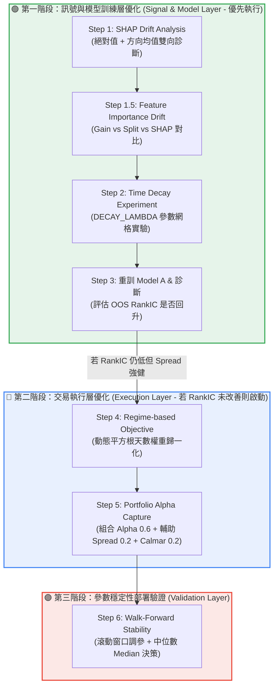

# 📋 量化交易系統最佳化器與模型層 — 升級研發路線圖 (2026/06 升級版)

> **文件目的**：根據 OOS 診斷報告與市場風格反轉現象，規劃模型層（`train.py`）與優化器（`optimize_trading_params.py`）的升級路線。
> **核心觀點**：模型結構落後市場（MR 轉 Momentum）是目前主要矛盾，而非交易風控參數失效。因此應**先優化模型訊號層，再優化交易執行層**。
> **跳轉連結規範**：本文件內所有檔案連結均使用相對路徑（如 [config.py](config.py)）。

---

## 📅 雙階段研發執行順序 (Phase-by-Phase Plan)



---

## 🟢 第一階段：訊號與模型訓練層優化 (Signal & Model Layer)

### 📌 Step 1: SHAP Drift Analysis (絕對值與方向性雙向診斷)

*   **核心痛點**：IC 與 PSI 只能觀察邊際分布的漂移，無法反映特徵在模型決策中的實質貢獻與方向變化。例如昨日報酬率 `ret1` 在樣本內為均值回歸（負向貢獻），在樣本外卻轉為動能追漲（正向貢獻）。
*   **優化方案**：
    在 [scripts/analyze_regime_stability.py](file:///D:/Vscode_workspace/Stock/scripts/analyze_regime_stability.py) 中，利用 LightGBM 內建極速預測機制計算 IS 與 OOS 的 SHAP 值：
    ```python
    shap_values = model.predict(X, pred_contrib=True)
    ```
    *   **指標設計**：同時輸出「絕對值均值（貢獻大小）」與「原始均值（貢獻方向）」：
        1.  **SHAP Importance**：`mean(abs(shap))`，衡量因子貢獻度是否衰退。
        2.  **SHAP Direction**：`mean(shap)`，衡量因子作用方向是否反轉（Regime Shift 的決定性證據）。
    *   **整合規範**：SHAP Drift Analysis 將列為 [run_workflow_experiment.py](run_workflow_experiment.py) 的**必跑核心項目**。

---

### 📌 Step 1.5: Feature Importance Drift (特徵重要性一致性對比)

*   **核心目的**：對比模型結構重要性（Gain/Split）與樣本實質貢獻（SHAP），找出真正發生特徵空間扭曲的源頭。
*   **優化方案**：
    在診斷報告中整合三維度特徵重要性對比：
    *   **Gain Importance**：節點分裂帶來的總增益（訓練期擬合權重）。
    *   **Split Importance**：特徵被分裂的總次數（決策覆蓋率）。
    *   **SHAP Importance**：OOS 的實質邊際貢獻。
    *   **診斷邏輯**：找出高 Gain 但 OOS SHAP 衰退或方向反轉的因子，作為特徵調整或加權的依據。

---

### 📌 Step 2: Time Decay Experiment (時間衰減網格實驗)

*   **核心目的**：透過網格搜尋找出能最有效抑制 Drift 且不引入前視偏差的時間衰減係數。
*   **優化方案**：
    在 [scripts/train.py](scripts/train.py) 中引入 `DECAY_LAMBDA` 網格實驗：
    *   **網格範圍**：$\lambda \in [0.0, 0.001, 0.002, 0.003, 0.005]$ (其對應半衰期如下表)。
    *   **評估指標**：比較不同 $\lambda$ 模型在 OOS 區間的 `RankIC`、`Top1% Alpha` 與 `LS Spread`。
    *   **防範機制**：**暫不引入任何 `regime_weight`**，防止風格追逐（Regime Chasing）與半前視偏差。僅在 SHAP Drift 顯示連續 6 個月方向一致時，未來才考慮引入 Regime 權重。
    
    | 衰減係數 ($\lambda$) | 半衰期（天數） | 意義 |
    | :---: | :---: | :--- |
    | 0.000 | $\infty$ | 傳統等權重學習（舊版） |
    | 0.001 | 約 693 天 | 溫和衰減，保留長線基本面資訊 |
    | 0.002 | 約 346 天 | 中度衰減，偏向近一年市場風格 |
    | 0.003 | 約 231 天 | 快速衰減，聚焦近三季市場結構 |
    | 0.005 | 約 138 天 | 極速衰減，僅學習近半年的超短期慣性 |

---

### 📌 Step 3: 重訓 Model A 與診斷

*   **優化方案**：
    *   將網格搜尋出的最佳 `DECAY_LAMBDA` 套用至 Model A。
    *   執行 OOS 診斷，觀察 OOS RankIC（原為 0.0269）是否能有效回升。

---

## 🔵 第二階段：交易執行層優化 (Execution Layer)

*(註：若第一階段重訓後 OOS RankIC 仍低，但 OOS Spread/Alpha 強健，則代表選股排序力在尾部依然有效，應啟動此階段優化交易層。)*

### 📌 Step 4: Regime-based Objective (動態天數權重歸一化)

*   **優化方案**：在 [trading_sim.py](trading_sim.py) 中計算每日 `regime`，並在 [scripts/optimize_trading_params.py](scripts/optimize_trading_params.py) 中將歷史按市況（Bull / Bear / Sideways）分組評分。
*   **平方根平滑降權機制（Scarcity Weighting）**：
    
    $$W_r = \min\left(1.0, \sqrt{\frac{N_r}{60}}\right)$$
    
    *   **歸一化加權平均公式（Combined Score）**：
        為避免直接相乘導致負分數被削弱的 Bug，改用歸一化加權平均：
        
        $$\text{Combined Score} = \frac{W_{\text{bull}} \cdot S_{\text{bull}} + W_{\text{bear}} \cdot S_{\text{bear}} + W_{\text{sidew}} \cdot S_{\text{sidew}}}{W_{\text{bull}} + W_{\text{bear}} + W_{\text{sidew}}}$$

---

### 📌 Step 5: Portfolio Alpha Capture (組合層級 Alpha 與輔助 Spread)

*   **優化方案**：
    在評分函數中引入**組合層級**的實際持倉 Alpha 與輔助 Spread 指標：
    1.  **實際持倉 Alpha** (`portfolio_alpha` - **核心指標**):
        $$\text{Alpha}_t = \text{Portfolio Return}_t - \text{Market Mean Return}_t$$
    2.  **實際持倉 Spread** (`portfolio_spread` - **輔助指標**):
        $$\text{Spread}_t = \text{Portfolio Return}_t - \text{Model Bottom 5\% Mean Return}_t$$
        *(註：Bottom 5% 易受極端事件與流動性影響，故權重需調低。)*
        
    *   **調參評分公式（Objective Score）**：
        $$\text{Sub-Period Score} = 0.6 \cdot \text{portfolio\_alpha} + 0.2 \cdot \text{portfolio\_spread} + 0.2 \cdot \text{calmar\_ratio}$$

---

## 🟣 第三階段：參數穩定性部署驗證 (Validation Layer)

### 📌 Step 6: Walk-Forward Stability (中位數決策驗證)

*   **優化方案**：
    *   在 [scripts/optimize_trading_params.py](scripts/optimize_trading_params.py) 中新增 `--walk_forward` 模式，切分 4 個滾動時間窗口搜尋。
    *   **部署決策原則**：**嚴禁採用 Mean 作為部署參數值**，以防離群值失真。**必須採用中位數（Median）作為部署值**。
    *   報告需同時輸出：`Median`、`IQR（四分位距）` 與 `CV（變異係數）`，用以評估參數穩定度。

---

## 🛠️ 中央設定檔變更計畫 ([config.py](config.py))

```python
# ── 新增：優化目標權重設定 ──
PORTFOLIO_ALPHA_WEIGHT = 0.6     # 組合 Alpha 權重 (核心)
PORTFOLIO_SPREAD_WEIGHT = 0.2    # 組合 Spread 權重 (輔助)
CALMAR_SCORE_WEIGHT     = 0.2    # Calmar 比率權重

# ── 新增：模型訓練時間衰減網格常數 ──
DECAY_LAMBDA_GRID    = [0.0, 0.001, 0.002, 0.003, 0.005]
DEFAULT_DECAY_LAMBDA = 0.002   # 預設半衰期約一年的衰減係數
```

---

*本文件由 Antigravity AI 量化研究團隊與研究員共同校正，最後更新：2026-06-07*
