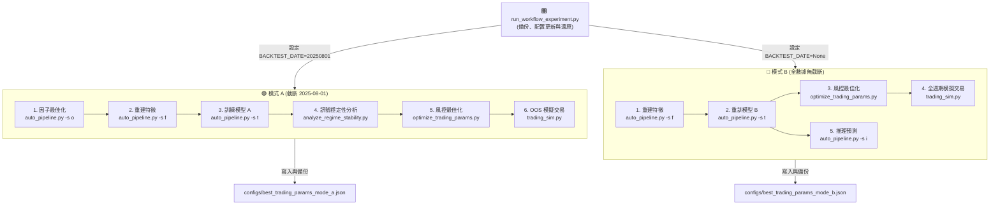

# 🎛️ run_workflow_experiment.py 使用說明與技術架構指南

本指南詳細介紹 `run_workflow_experiment.py` 腳本的設計理念、調用架構、執行參數、數據加載機制以及如何將實驗結果套用至您的實盤生產系統中。

---

## 🎯 1. 核心設計理念與工作流

量化交易系統的致命傷是**前視偏差 (Lookahead Bias)** 與**過擬合 (Overfitting)**。為了防止系統在歷史數據上調出「看似完美」但在實盤中迅速失效的參數，本腳本實現了**雙階段時光機沙盒實驗**：

*   **🟢 模式 A (研究模式 - 樣本外測試)**：
    將時光倒回 `2025-08-01`。模型完全不知道之後大盤會漲到四萬點。我們在 `2025-08-01` 之前的數據上調參並訓練模型，隨後在 `2025-08-02 ~ 2026-06-05` 這段未知的「超級牛市」中進行回測，用以**驗證策略在全新市場環境下的泛化防禦力**。
*   **🔵 模式 B (生產模式 - 全數據覆蓋)**：
    模型每天重訓並吸收包含最新大牛市的完整特徵。同時，風控優化器也在包含這段牛市的全週期上調參，用以**優化出一組最契合當前大波動行情的黃金避險參數**，防止避險過度敏感而在牛市中少賺。

### 台股市場背景（為何需要雙模式）

台股近年歷經典型的多空輪轉，直接影響風控參數的最佳值：

| 年份 | 市況 | 指數區間 | 對風控的意義 |
| :--- | :--- | :--- | :--- |
| 2022 | 標準熊市，趨勢向下 | ~18,000 → ~12,600 | 停損要緊、避險要靈敏 |
| 2023 | 絕地反彈復甦年 (+26.8%) | ~12,600 → ~17,900 | 中性，需兼顧攻守 |
| 2024 | 超級牛市＋劇烈洗盤（全球第二強）| ~17,900 → ~23,000 | 停損需放寬、追漲需積極 |
| 2025~2026 | 破紀錄狂牛（22,000 → 45,000+）| ~22,000 → ~45,000+ | 保守參數極易被正常回檔洗出場 |

> [!IMPORTANT]
> 模式 A 的風控參數是在**含有 2022 熊市的歷史數據**上調出來的，天然偏保守。在 2025 年這波急漲行情中，保守的停損（-7%）和避險紅燈（breadth < 17%）幾乎每次正常回檔都會觸發，導致頻繁出場後眼看大盤繼續上漲。**這是預期行為，不代表策略失敗。** 模式 B 的存在正是為了校正這個問題。

---

## 🔌 2. 系統調用架構圖

本實驗腳本扮演「總控制台」的角色，透過 `subprocess` 沙盒進程安全地調用系統中各個模組：



---

## 📝 3. 執行參數與命令列選項 (CLI Options)

本腳本提供了靈活的命令列參數，方便您在不修改代碼的情況下調整實驗規模：

| 短參數 | 長參數 | 類型 | 預設値 | 說明 |
| :--- | :--- | :--- | :--- | :--- |
| `-f` | `--factor_trials` | `int` | `400` | 模式 A 中 `optimize_factors.py` 的最大搜尋輪數。 |
| `-fe`| `--factor_early_stopping`| `str`| `"150"` | 因子搜尋無進展多少輪後自動終止 (`None` 代表不啟用)。 |
| `-t` | `--trading_trials` | `int` | `400` | 模式 A / 模式 B 中 `optimize_trading_params.py` 的最大搜尋輪數。 |
| `-te`| `--trading_early_stopping`| `str`| `"150"` | 風控搜尋無進展多少輪後自動終止 (`None` 代表不啟用)。 |
| `-c` | `--capital` | `int` | `2000000`| 模擬交易與風控調參時的初始資金量。 |
| ❌ | `--skip_factor_opt` | `bool`| `False` | 模式 A 中是否跳過因子調參，直接沿用現有的 `configs/best_factors.json`。 |
| ❌ | `--fresh` | `bool`| `False` | 強制重新執行所有步驟，忽略現有的 Checkpoint 與中間 JSON 檔。 |

> [!TIP]
> 預設的因子搜尋設為 `400` 輪（早停 `150`）、風控搜尋設為 `400` 輪（早停 `150`），適合過夜跑完完整的高品質實驗。如需快速驗證流程，可執行 `python run_workflow_experiment.py -f 30 -fe 15 -t 100 -te 30` 縮短至數十分鐘。

---

## 🔍 4. 詳細執行步驟、參數與載入數據

### 📂 步驟 1：安全備份與初始化
*   **載入數據與狀態**：檢測 `configs/` 目錄下是否存在 `config.py`、`best_factors.json` 和 `best_trading_params.json`。
*   **執行動作**：將上述三檔複製並備份為 `.workflow.bak` 檔。如果原本沒有 `configs/best_factors.json` 或 `configs/best_trading_params.json`，則記錄其 nonexistent 狀態。
*   **目的**：確保在實驗過程中，不論發生程式崩潰、斷電或手動終止，都能在退出時 100% 還原主系統的狀態。

---

### 🟢 步驟 2：模式 A (研究模式) 運行

#### 2.1 因子指標優化 (Factor Optimization)
*   **調用指令**：`python auto_pipeline.py -s o`
*   **寫入配置**：
    *   將 `config.py` 中的 `BACKTEST_DATE` 設為 `"20250801"`。
    *   將 `RUN_OPTIMIZATION` 設為 `True`，將 `OPTIMIZATION_TRIALS` 設為 `-f` 參數值，將 `EARLY_STOPPING_ROUNDS` 設為 `-fe` 參數值。
*   **載入數據**：加載 `data/raw_price/` 的每日收盤行情與 `config.py` 中的 `TRAIN_INDUSTRIES` 對應股票。
*   **執行內容**：Optuna 在 2025-08-01 之前的訓練集上尋找最佳技術指標參數（MA、RSI、MACD 等均線窗口），以最大化分類勝率。
*   **輸出產出**：寫入最佳因子到 `configs/best_factors.json`。

#### 2.2 重建特徵與訓練模型 A
*   **調用指令**：`python auto_pipeline.py -s f` 與 `python auto_pipeline.py -s t`
*   **載入數據**：
    *   讀取剛生成的 `configs/best_factors.json`。
    *   讀取 `data/` 目錄下三大法人籌碼、融資融券、大戶持股與基本面季報。
*   **執行內容**：以最佳因子重新計算所有股票的技術指標與總體/板塊特徵，並只採用 `2025-08-01` 之前的數據訓練 LightGBM 分類模型。
*   **輸出產出**：儲存模型至 `models/lgbm_model_1.txt`，特徵欄位順序存至 `models/feature_cols.json`。

#### 2.3 訊號穩定性診斷
*   **調用指令**：`python scripts/analyze_regime_stability.py`
*   **載入數據**：載入整個特徵 Parquet 檔與剛剛訓練好的模型 `lgbm_model_1.txt`。
*   **執行內容**：計算 2025-08-01 之後「樣本外測試集 (OOS)」的 RankIC、第一名組別超額 Alpha 獲利率、特徵 PSI 漂移度。
*   **輸出產出**：將訊號診斷日誌寫入 `reports/regime_stability_report.txt`，實驗腳本會將其複製備份為 [reports/mode_a_regime_stability_report.txt](reports/mode_a_regime_stability_report.txt)。

#### 2.4 歷史風控參數調參
*   **調用指令**：`python scripts/optimize_trading_params.py -t <trials> -s 2021-01-02 -e 2025-08-01 -c <capital>`
*   **寫入配置**：將 `config.py` 中的 `EARLY_STOPPING_ROUNDS` 設為 `-te` 參數值。
*   **載入數據**：加載 `features_combined.parquet`、`models/lgbm_model_1.txt` 與歷史大盤指數。
*   **執行內容**：限制在 2025-08-01 以前的多空市況中（**絕對不讓 Optuna 看到未來牛市**），尋找最優風控配置（如停損線、避險紅燈）。
*   **輸出產出**：最佳參數寫入 `configs/best_trading_params.json`，實驗腳本將其備份為 `configs/best_trading_params_mode_a.json`。

#### 2.5 樣本外模擬交易 (時光機回測)
*   **調用指令**：`python trading_sim.py -s 2025-08-02 -e 2026-06-05 -c <capital>`
*   **載入數據**：加載 Model A 模型、`configs/best_trading_params.json`（模式 A 風控）、`Stocks.txt` 自選股與 OOS 期間的股價及大盤數據。
*   **執行內容**：在 `2025-08-02 ~ 2026-06-05` 超級牛市中模擬實盤交易，模擬台股 T+2 交割機制，計入手續費與稅金。
*   **輸出產出**：解析回測 terminal 輸出的「區間報酬」與「最大回撤」，寫入實驗日誌。

---

### 🔵 步驟 3：模式 B (實盤模式) 運行

#### 3.1 沿用因子與特徵重建
*   **調用指令**：`python auto_pipeline.py -s f`
*   **寫入配置**：
    *   將 `config.py` 中的 `BACKTEST_DATE` 設為 `None`。
    *   將 `RUN_OPTIMIZATION` 設為 `False`（沿用模式 A 優化出的 `configs/best_factors.json`，以節省時間）。
*   **執行內容**：將最完整的歷史數據（截至今日）合併重建。由於 `BACKTEST_DATE = None`，流水線會自動將特徵分界點設置在「一年前的最近交易日」，實現動態滾動。

#### 3.2 重訓模型 B (包含牛市)
*   **調用指令**：`python auto_pipeline.py -s t`
*   **執行內容**：重新訓練 LightGBM 模型。此時訓練集會自動滾動涵蓋 2025-08 到 2026-06 的超級牛市數據。模型大腦擁有了最新高點大盤的特徵分佈與選股記憶。
*   **輸出產出**：覆蓋更新 `models/lgbm_model_1.txt`。

#### 3.3 全週期風控參數優化 (覆蓋牛市)
*   **調用指令**：`python scripts/optimize_trading_params.py -t <trials> -s 2023-01-01 -e 2026-06-01 -c <capital>`
*   **寫入配置**：將 `config.py` 中的 `EARLY_STOPPING_ROUNDS` 設為 `-te` 參數值。
*   **執行內容**：在涵蓋這段超級牛市的完整週期上進行風控優化。Optuna 此時能夠親眼見識到牛市的劇烈個股波動和大盤的極端強勢，藉以放寬避險紅燈與停損範圍，以免在牛市中被過早震盪洗出場。
*   **輸出產出**：最佳參數寫入 `configs/best_trading_params.json`，實驗腳本將其備份為 `configs/best_trading_params_mode_b.json`。

#### 3.4 全週期模擬交易回測
*   **調用指令**：`python trading_sim.py -s 2023-01-01 -e 2026-06-05 -c <capital>`
*   **執行內容**：套用 Model B 與模式 B 風控進行全週期回測，並解析其回報與回撤。

#### 3.5 生成明日實盤推理下單建議
*   **調用指令**：`python auto_pipeline.py -s i`
*   **執行內容**：以最新重訓完的模型 B，結合剛剛生成的模式 B 最佳風控參數，直接為明天的台股交易日輸出具體的買賣掛單限價指引。

---

### 📊 步驟 4：對比報告生成與安全還原
*   **執行內容**：
    1.  讀取模式 A 訊號診斷報告中的相關 RankIC 指標。
    2.  將模式 A 與模式 B 的參數、報酬與 MDD 以表格對比格式寫入 [reports/workflow_experiment_report.md](reports/workflow_experiment_report.md)。
    3.  從備份檔 `.workflow.bak` 中，完美還原 `config.py`、`configs/best_factors.json` 和 `configs/best_trading_params.json` 到最原始狀態，確保實盤無任何副作用。

---

## ⚙️ 5. 參數套用 (Release) 行動指南

當您執行完實驗並仔細評估了 [reports/workflow_experiment_report.md](reports/workflow_experiment_report.md) 後，如何將新參數上線？

### 💡 核心機制：config.py 自動載入與動態覆寫
本系統設計了**零人工代碼干預的動態參數覆寫機制**。當任何系統腳本（包括 `inference.py`、`trading_sim.py`、`auto_pipeline.py` 等）載入 [config.py](config.py) 時，[config.py](config.py) 的初始化邏輯會**自動偵測**專案 `configs/` 目錄下是否存在 `best_trading_params.json`：
- **如果存在**：系統會直接讀取 JSON 中的最佳風控參數（如 `buy_threshold`, `stop_loss`, `panic_ma5`, `panic_breadth`, `ts_activation`, `ts_pullback` 等），並**在記憶體中自動覆寫** [config.py](config.py) 的預設變數。
- **如果不存在**：系統則降級使用 [config.py](config.py) 檔案中硬編碼的靜態常數值。

因此，您**完全不需要手動修改 config.py 中的參數代碼**。只需透過檔案複製切換 JSON 設定，全系統的所有模組（回測、模擬、推理）將立即自動套用最新最優風控值。

### 🔹 情境一：採用模式 B 優化出的黃金風控配置（推薦）
這通常是最佳選擇，因為模式 B 經歷了最新大牛市的洗禮，其風控配置最適應當前市場：

```powershell
# 將模式 B 的黃金風控複製為系統正式設定
copy configs\best_trading_params_mode_b.json configs\best_trading_params.json
# 下午收盤後照常執行，系統自動套用新風控
python Auto_RUN.py
```

### 🔹 情境二：採用實驗優化出的最優因子 (MA, RSI 週期等)
如果您重新執行了因子最佳化（即沒有使用 `--skip_factor_opt`），且發現新因子的 RankIC 顯著高於舊因子：

```powershell
# 1. 將實驗產生的模式 A 最佳因子複製為系統正式設定
copy configs\best_factors_mode_a.json configs\best_factors.json
# 2. 根據新因子重新計算特徵
python auto_pipeline.py -s f
# 3. 重新訓練模型（讓模型學習新因子的特徵空間）
python auto_pipeline.py -s t
```

### 🔹 情境三：OOS 績效不佳，只重跑風控調參

```powershell
# 刪除風控 checkpoint，保留耗時的因子 checkpoint
del configs\best_trading_params_mode_a.json
del configs\best_trading_params_mode_b.json
python run_workflow_experiment.py --skip_factor_opt
```

---

## 📊 6. 如何判讀實驗報告

實驗結束後，先閱讀 [reports/workflow_experiment_report.md](reports/workflow_experiment_report.md)，再對照以下標準評估策略健康度。

### 6.1 訊號診斷指標（`reports/mode_a_regime_stability_report.txt`）

| 指標 | 健康範圍 | 警示值 | 建議行動 |
| :--- | :--- | :--- | :--- |
| **IS All RankIC** | > 0.03 | < 0.01 | 因子對歷史數據幾乎無預測力，考慮重新調參 |
| **OOS All RankIC** | > 0.02 | < 0.00 | 模型無法泛化到新市場，可能過擬合 |
| **OOS Bull RankIC** | > 0.03 | < 0.01 | 模型在牛市選股失效，特徵漂移嚴重 |
| **OOS Top 1% Alpha** | > +1.5%/日 | < +0.5%/日 | 模型無法識別真正的強勢股 |
| **PSI 嚴重漂移特徵數** | 0~2 個 | > 5 個 | 需重新評估特徵工程或加入新特徵 |

### 6.2 OOS 回測績效判讀（模式 A，OOS 期間為超級牛市）

| 指標 | 強勁 | 可接受 | 需調整 |
| :--- | :--- | :--- | :--- |
| **累計報酬率** | > +30% | +10% ~ +30% | < +10% 或負報酬 |
| **最大回撤 MDD** | < -15% | -15% ~ -25% | > -30% |
| **Calmar 比率（報酬 / MDD）** | > 2.0 | 1.0 ~ 2.0 | < 1.0 |

> [!NOTE]
> 模式 A 的 OOS 區間（2025-08-02 ~ 2026-06-05）是台股史上最強的半年牛市，大盤從 22,000 漲至 45,000。若模式 A 在此期間仍能正報酬，代表策略具備極強的市場適應力。如果報酬落後大盤，通常是避險機制在正常回檔時頻繁觸發所致，而非選股方向錯誤——此時應採用模式 B 的風控參數上線。

### 6.3 模式 A vs 模式 B 風控參數對比解讀

下表說明在正常情況下，模式 B 的參數應比模式 A 更寬鬆：

| 參數 | 模式 A 典型值（含熊市調參） | 模式 B 典型值（含牛市調參） | 意義 |
| :--- | :--- | :--- | :--- |
| `buy_threshold` | 15~20% | 8~12% | 牛市訊號多，B 更積極進場 |
| `stop_loss` | -6% ~ -8% | -10% ~ -15% | 牛市波動大，B 給更多容錯空間 |
| `panic_ma5` | -0.010 ~ -0.015 | -0.025 ~ -0.045 | B 不因短暫回檔觸發避險 |
| `panic_breadth` | 0.20 ~ 0.30 | 0.10 ~ 0.17 | B 允許更大面積個股下跌才避險 |

若模式 A 的避險門檻比模式 B **嚴格許多**，且 OOS 報酬明顯落後 → 策略在牛市被頻繁洗出場，**直接採用模式 B 參數上線**即可解決。

---

## 🔧 7. OOS 績效不佳的診斷與調整流程

### 7.1 先診斷「為什麼差」

開啟 `reports/backtest_equity_2025-08-02_2026-06-05.csv` 或對應的交易明細，觀察以下現象：

| 觀察到的現象 | 根本原因 | 對應調整 |
| :--- | :--- | :--- |
| 進場次數極少，資金長期閒置 | `buy_threshold` 太高，訊號難觸發 | 降低 `BUY_THRESHOLD` |
| 頻繁停損出場，每次損失 -7% 左右 | `stop_loss` 太緊，正常回檔被強制賣出 | 放寬 `STOP_LOSS_PCT` |
| 大盤小幅回檔後全部持股被平倉 | `panic_ma5` / `panic_breadth` 太靈敏 | 放寬避險門檻 |
| 持股方向正確，但移動止盈太早賣出 | `ts_activation` 太低 / `ts_pullback` 太緊 | 調高啟動門檻或放寬回撤容忍 |
| 買進的股票本身就持續下跌 | 模型選股能力不足（OOS RankIC < 0）| 重新調整因子（`--fresh` 重跑）|

### 7.2 各風控旋鈕的調整方向

以下參數均定義於 [config.py](config.py)，也可透過 [scripts/optimize_trading_params.py](scripts/optimize_trading_params.py) 的搜尋邊界自動調整：

| 參數名稱 | 保守（熊市）| 均衡 | 積極（牛市）| 當前牛市建議方向 |
| :--- | :---: | :---: | :---: | :--- |
| `BUY_THRESHOLD` | 20%+ | 12~15% | 8~10% | ↓ 降低，更積極進場 |
| `STOP_LOSS_PCT` | -5% ~ -7% | -8% ~ -10% | -12% ~ -15% | ↓ 更大容忍空間 |
| `MKT_PANIC_MA5` | -0.010 | -0.020 | -0.035 ~ -0.050 | ↓ 更不易觸發避險 |
| `MKT_PANIC_BREADTH` | 0.30 | 0.20 | 0.12 ~ 0.15 | ↓ 更低閾值才避險 |
| `TS_ACTIVATION_PCT` | 10% | 15% | 20 ~ 25% | ↑ 更高漲幅才啟動移動止盈 |
| `TS_PULLBACK_PCT` | -5% | -8% | -12 ~ -15% | ↓ 允許更大回撤才止盈出場 |

### 7.3 分層調整策略（由快到慢）

**第一層（最快，今天就能測試）**：直接採用模式 B 已調好的牛市風控

```powershell
copy configs\best_trading_params_mode_b.json configs\best_trading_params.json
python auto_pipeline.py -s i
```

**第二層（數小時）**：只重跑風控調參，讓 Optuna 在包含更多牛市的區間重新搜尋

```powershell
# 刪除模式 A 風控 checkpoint（同時修改 run_workflow_experiment.py 第 496 行
# 將 -s 2021-01-02 改為 -s 2023-01-01，讓調參區間涵蓋更多牛市數據）
del configs\best_trading_params_mode_a.json
python run_workflow_experiment.py --skip_factor_opt
```

**第三層（過夜）**：全流程重跑，重新搜尋最佳因子與風控組合

```powershell
python run_workflow_experiment.py --fresh
```

---

## 🔁 8. 中斷後的 Checkpoint 續傳機制

實驗支援自動續傳，**中途崩潰或手動 Ctrl+C 後，重新執行同一指令即可從斷點繼續**，無需重跑耗時的 Optuna 調參步驟。

### Checkpoint 檔案對照表

| Checkpoint 檔案 | 命中時跳過的步驟 | 估計節省時間 |
| :--- | :--- | :--- |
| `configs/best_factors_mode_a.json` | 模式 A 因子調參（Optuna）| 1 ~ 3 小時 |
| `reports/mode_a_regime_stability_report.txt`（含 All 行）| 模式 A 特徵重建 + 模型訓練 + 訊號診斷 | 20 ~ 40 分鐘 |
| `configs/best_trading_params_mode_a.json` | 模式 A 風控調參（Optuna）| 2 ~ 4 小時 |
| `workflow_experiment_results.json` 中 `oos_return`/`oos_mdd` 不為零 | 模式 A OOS 模擬交易 | 5 ~ 10 分鐘 |
| `configs/best_trading_params_mode_b.json` | 模式 B 特徵重建 + 模型重訓 + 風控調參 | 3 ~ 6 小時 |
| `workflow_experiment_results.json` 中 `full_return`/`full_mdd` 不為零 | 模式 B 全週期模擬交易 | 5 ~ 10 分鐘 |

> [!WARNING]
> 若 `configs/best_trading_params_mode_b.json` Checkpoint 命中，系統將同時跳過模式 B 的特徵重建與模型重訓。此時 `models/lgbm_model_*.txt` 應為上次執行留下的模式 B 模型。若您曾在實驗期間手動修改模型，請加上 `--fresh` 強制全部重跑。

### 強制全部重跑（忽略所有 Checkpoint）

```powershell
python run_workflow_experiment.py --fresh
```

---

## 🗓️ 9. 何時應重新執行整個實驗

| 觸發條件 | 建議動作 |
| :--- | :--- |
| **每季定期維護**（每 3 個月）| `python run_workflow_experiment.py --skip_factor_opt`（只更新風控）|
| **市場結構重大轉變**（如牛市轉熊市、重大政策事件）| `python run_workflow_experiment.py --fresh`（全部重跑）|
| **新增或移除 `TRAIN_INDUSTRIES` 產業** | `python run_workflow_experiment.py --fresh` |
| **OOS 實盤績效連續 2 個月明顯下滑** | 先依第 7 節診斷，再選擇對應調整層級 |
| **`feature_engineering.py` 新增重要特徵** | `python run_workflow_experiment.py --fresh` |
| **`Stocks.txt` 自選股大幅調整** | `python run_workflow_experiment.py --skip_factor_opt` |
