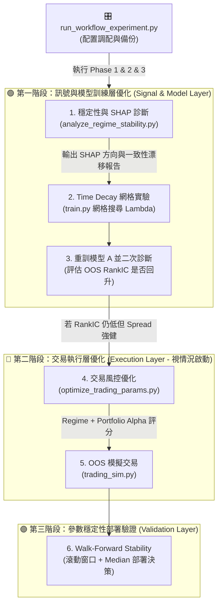

# 🎛️ run_workflow_experiment.py 使用說明與技術架構指南 (2026/06 升級版)

本指南詳細介紹 `run_workflow_experiment.py` 腳本的設計理念、雙階段研發沙盒流程、指標判讀原則，以及如何在系統升級後進行交易與訊號優化。

---

## 🎯 1. 核心設計理念：雙階段沙盒實驗

為了防止量化策略因**前視偏差 (Lookahead Bias)** 與**過擬合 (Overfitting)** 在實盤中失效，本系統實現了**雙階段時光機沙盒實驗**：

*   **🟢 模式 A (研究模式 - 乾淨樣本外)**：
    將時光倒回 `2025-08-01`。我們在 `2025-08-01` 之前的數據上調參並訓練模型，隨後在 `2025-08-02 ~ 2026-06-05` 這段未知的「超級牛市」中進行回測，驗證策略在全新市場環境下的泛化防禦力。
*   **🔵 模式 B (生產模式 - 全數據滾動)**：
    模型滾動重訓至最新日期。風控優化器在全週期上進行 Walk-Forward 最佳化，調整出最契合當前大波動行情的黃金避險參數，防止在牛市中避險過度敏感而被輕易洗出場。

---

## 🔌 2. 系統調用與三階段研發流程圖

量化升級的核心順序為：**先優化模型訊號層（定位與處理漂移），再優化交易執行層，最後進行 Walk-Forward 穩定性驗證。**



---

## 📝 3. 執行參數與命令列選項 (CLI Options)

| 短參數 | 長參數 | 類型 | 預設値 | 說明 |
| :--- | :--- | :--- | :--- | :--- |
| `-f` | `--factor_trials` | `int` | `400` | 模式 A 中 `optimize_factors.py` 的最大搜尋輪數。 |
| `-fe`| `--factor_early_stopping`| `str` | `150` | 因子調參早停輪數 (無進度達此輪數自動終止，`None` 代表不啟用)。 |
| `-t` | `--trading_trials` | `int` | `400` | 模式 A / 模式 B 中風控調參的最大搜尋輪數。 |
| `-te`| `--trading_early_stopping`| `str` | `150` | 風控調參早停輪數 (無進度達此輪數自動終止，`None` 代表不啟用)。 |
| `-c` | `--capital` | `int` | `2000000`| 模擬交易與風控調參時的初始資金量。 |
| `--skip_factor_opt` | ❌ | `bool`| `False` | 模式 A 中是否跳過因子調參，直接沿用現有的 `configs/best_factors.json`。 |
| `--fresh` | ❌ | `bool`| `False` | 強制重新執行所有步驟，忽略現有的 Checkpoint 與中間 JSON 檔。 |

---

## 🔍 4. 詳細執行步驟與數據載入

### 📂 步驟 1：安全備份與環境初始化
*   將 [config.py](config.py)、`configs/best_factors.json` 和 `configs/best_trading_params.json` 備份為 `.workflow.bak` 檔，確保程式不論因何種原因中斷，都能在結束時 100% 還原主系統的狀態。

---

### 🟢 步驟 2：模式 A (研究模式) 運行

#### 2.1 訊號與 SHAP 穩定性診斷 (Step 1 & 1.5 - 核心項目)
*   **調用指令**：`python scripts/analyze_regime_stability.py`
*   載入模型與 OOS 數據，利用 LightGBM 內建之 `predict(..., pred_contrib=True)` 計算 Class 2 (強勢上漲) 的特徵 SHAP 值。
*   輸出 **SHAP Drift 報告**（絕對值 + 方向均值）與 **Feature Importance 一致性對比表**（Gain vs Split vs SHAP），定位因市場機制反轉（如 MR 轉 Momentum）導致偏見的因子。

#### 2.2 Time Decay 網格實驗與模型重訓 (Step 2 & 3)
*   **調用指令**：在 [scripts/train.py](scripts/train.py) 中，對時間衰減係數 $\lambda \in [0.0, 0.001, 0.002, 0.003, 0.005]$ 進行網格搜尋。
*   比較不同 $\lambda$ 模型在 OOS 區間的 `RankIC`、`Top1% Alpha` 與 `LS Spread`，挑選最佳 $\lambda$。
*   **安全防範**：此階段暫不引入任何 `regime_weight` 訓練加權，避免風格追逐與半前視偏差。
*   使用最優 $\lambda$ 重訓模型 A，並跑二次診斷評估 OOS RankIC 是否回升。

#### 2.3 交易風控參數最佳化 (Step 4 & 5)
*   **調用指令**：`python scripts/optimize_trading_params.py -t <trials> -s 2021-01-02 -e 2025-08-01 -c <capital> -wf`
*   **Regime-based Objective**：按市況（Bull/Bear/Sideways）分組評估，天數權重採平方根平滑降權 $W_r = \min(1.0, \sqrt{N_r/60})$，以解決小樣本市況下的噪訊問題。採用「歸一化加權平均」融合各得分，防止負得分被降權相乘的 Bug。
*   **Portfolio Alpha Capture**：目標評分函數權重為組合 Alpha（0.6）、組合 Spread（0.2）與 Calmar 比率（0.2）。

#### 2.4 Walk-Forward Stability 部署驗證 (Step 6)
*   啟用 `--walk_forward` 模式，在 4 個滾動時間窗口下調參。
*   **部署決策原則**：**嚴禁採用 Mean 作為部署值**。必須計算並輸出參數的 `Median（中位數）`、`IQR（四分位距）` 與 `CV（變異係數）`，並**以 Median 作為最終部署參數**。

---

### 🔵 步驟 3：模式 B (實盤生產模式) 運行

#### 3.1 參數與特徵重置
*   修改設定檔，將 `BACKTEST_DATE` 切換為 `None`，`RUN_OPTIMIZATION` 切換為 `False`（沿用模式 A 的最佳因子以節省高達數小時的因子搜尋時間）。
*   **調用指令**：`python auto_pipeline.py -s f`
*   重建包含 2025-08-01 之後最新大牛市數據的特徵矩陣。

#### 3.2 納入牛市全週期模型訓練
*   **調用指令**：`python auto_pipeline.py -s t`
*   使用包含最新牛市數據的完整特徵集，重訓最終的生產型 LightGBM 模型。

#### 3.3 全週期風控調參 (覆蓋牛市與熊市)
*   **調用指令**：`python scripts/optimize_trading_params.py -t <trials> -s 2023-01-01 -e 2026-06-01 -c <capital> -wf`
*   在包含 2025-08 之後超級牛市的全時間段上執行 Walk-Forward 最佳化，搜尋最契合當下高波動多頭市況的黃金避險門檻與移動止盈配置，避免避險過於敏感而被洗出場。

#### 3.4 模擬交易與推理預測
*   **調用指令**：`python trading_sim.py -s 2023-01-01 -e 2026-06-05 -c <capital>`
*   執行全週期模擬交易，產生實盤表現與回撤數據。
*   **調用指令**：`python auto_pipeline.py -s i`
*   載入最新生產型模型，推理明日最新股票預測分數並輸出掛單溢價與台灣 Tick Size 對齊的交易建議。

---

### 🧪 步驟 3.5：潔淨樣本外 (OOS) 風控泛化驗證 (Stage C)

模式 B 的全週期報酬（優化窗 = 回測窗）屬**樣本內 (in-sample)**，無法回答「風控參數是否過擬合於 2023~2025-08」。Stage C 在模式 B 推理後自動執行，產出**乾淨的前瞻泛化證據**：

*   **凍結優化**：`python scripts/optimize_trading_params.py -t <trials> -s 2023-01-01 -e 2025-08-01 -wf --regime`——風控參數只在 cutoff 之前優化，且**還原 Model A** 為預測大腦，確保調參本身對測試期無 lookahead。凍結參數另存 `configs/best_trading_params_mode_b_oos.json`。
*   **雙模型 bracket 回測**（同一組凍結參數、同一未見區間 `2025-08-02 ~ 最新`）：
    *   **下界 = Model A**（`restore_models(".mode_a")`）：對測試期無 lookahead，但模型凍結於 cutoff 會退化。
    *   **上界 = Model B**（`restore_models(".mode_b")`）：含最新訓練無退化，但對測試期有 lookahead。
*   兩次回測共用同一凍結參數，純粹隔離「模型效應」；真實前瞻表現預期落在下界與上界之間。Stage C 結束會無條件還原 Model B，確保實盤生產大腦不被污染。
*   結果寫入報告新章節「🧪 潔淨樣本外 (OOS) 風控參數泛化驗證」，判讀原則見 §6.3。

> **限制**：本階段僅隔離「風控參數」泛化力；模型本身的 lookahead（Model B）與滾動重訓泛化屬獨立議題，須另靠紙上前瞻追蹤與 `analyze_regime_stability.py` 補強。Stage C 多跑一輪 Optuna（約 2~4 小時），已納入 checkpoint 可續傳。

---

### 📂 步驟 4：自動還原與異常回復 (Exception Safety)
*   在 `run_workflow_experiment.py` 中，不論實驗因為鍵盤中斷 (Ctrl+C) 還是內部錯誤 (Exception) 中止，最後的 `finally` 區塊保證會自動將 [config.py](config.py)、`configs/best_factors.json` 和 `configs/best_trading_params.json` 還原為最初備份，避免對每日生產自動化排程造成任何設定污染。

---

## 🔄 5. 斷點續傳 (Checkpoint / Breakpoint) 機制

為了防止大型實驗中途因網路、系統重開或記憶體耗盡崩潰，本腳本實施了**斷點續傳機制**：
*   **進度追蹤器**：中間執行結果會即時寫入 `reports/workflow_experiment_results.json`。重新運行相同指令時，只要不加 `--fresh`，腳本會自動讀取並跳過已完成的子模組。
*   **子步驟備份檔**：
    *   `configs/best_factors_mode_a.json`：模式 A 最優因子參數。
    *   `reports/mode_a_regime_stability_report.txt`：模式 A 的訊號診斷報告。
    *   `configs/best_trading_params_mode_a.json`：模式 A 的最優風控參數。
    *   `configs/best_trading_params_mode_b.json`：模式 B 的最優風控參數。
    *   `configs/best_trading_params_mode_b_oos.json`：Stage C 潔淨 OOS 驗證的凍結風控參數（優化窗 2023~2025-08）。
*   **除錯回滾機制**：若偵測到已存在的模擬交易結果報酬率與最大回撤均為 `0.0` (可能由於 Windows 特殊編碼錯誤導致無效輸出)，續傳機制會**自動判定該 Checkpoint 無效並重新執行**。
*   **🔑 優化器指紋自動失效 (2026-06-17)**：三段風控優化（模式 A／模式 B／Stage C）載入既有風控 checkpoint 前，會比對 `compute_opt_signature()` 指紋（= `optimize_trading_params.py` 原始碼 hash ＋ `--regime`/`-wf` 旗標）。**只要優化器原始碼或旗標一變動（或 checkpoint 為舊版無指紋），即印「⚠️ Checkpoint 失效」並自動重新優化**，不再靜默沿用過時參數。因此**改了優化器旗標或目標函式後，不必再手動刪檔**——直接重跑即可。此指紋驗證與模型還原刻意解耦（改優化器只重跑風控優化，不會強制重訓模型）。
    *   *副作用*：`optimize_trading_params.py` 任何編輯（含註解）都會使三段風控 checkpoint 失效並重優化（偏保守，安全優先）。
*   **強制重置**：若變更過模型結構或技術指標定義（這類不在指紋涵蓋範圍），仍須附加 `--fresh` 參數，強制忽略所有 checkpoint 備份進行全新完整運算。

---

## 📊 6. 如何判讀實驗報告與診斷結論

實驗結束後，請打開報告檔 `reports/workflow_experiment_report.md`，對照以下原則評估系統健康度。

### 6.1 訊號診斷指標

| 指標 | 健康範圍 | 警示值 | 說明與量化研究原則 |
| :--- | :--- | :--- | :--- |
| **IS All RankIC** | > 0.03 | < 0.01 | 因子對歷史數據的擬合預測力。 |
| **OOS All RankIC** | > 0.02 | < 0.00 | 越接近 0 代表選股排序能力完全失效。 |
| **OOS Top 1% Alpha** | > +0.5%/日 | < 0.00%/日 | 組合超額回報能力，0.5% 以上即為健康。 |
| **CV（變異係數）** | < 0.15 | > 0.30 | 超過 0.30 代表該風控參數在不同窗口極度不穩定，不可信賴。 |

---

### 6.2 核心量化研究診斷原則

#### 1. 區分「Alpha 衰退」與「模型失效」
*   當 OOS RankIC 較 IS 有所下降（例如從 0.044 降到 0.027）時，這是量化策略進入樣本外時正常的衰退現象。
*   只有當 RankIC 接近 0、多空價差（Spread）接近 0 且 t-stat $< 2$ 時，才定義為模型失效。切忌在策略僅僅是賺錢效率下降時，就盲目推翻重構。

#### 2. 利用 SHAP 均值方向定位偏見反轉
*   如果某因子（如 `ret1`）的絕對值 `SHAP (Abs)` 維持穩定或上升，但方向性 `SHAP (Mean)` 的正負號發生反轉（如從 $-0.012$ 變為 $+0.009$），這是市場從 **Mean Reversion 到 Momentum** 機制轉換的鐵證。
*   這代表模型在訓練集學到的規則在 OOS 產生了偏見。這也是我們第一優先進行 **Step 2 (Time Decay Experiment)** 的根本原因。

---

### 6.3 潔淨樣本外 (OOS) 風控泛化驗證判讀 (Stage C)

報告章節「🧪 潔淨樣本外 (OOS) 風控參數泛化驗證」呈現「凍結風控參數」在未見區間、雙模型下的 bracket。對照下表判讀：

| 情況 | 結論 |
| :--- | :--- |
| **下界 (Model A) 報酬仍為正、MDD 受控** | 風控參數本身具泛化力，mode B 樣本內高報酬**非純過擬合** ✅ |
| **下界轉負、上界 (Model B) 仍佳** | 優異績效主要來自模型對測試期的 **lookahead**，實盤須打折看待 ⚠️ |
| **下界、上界皆差** | 風控參數過擬合於 2023~2025-08，需回到 §7 流程重新檢視 ❌ |

> 真實前瞻表現預期落在下界與上界之間。本驗證只回答「風控參數是否泛化」；模型 lookahead 與滾動重訓泛化屬獨立議題，仍須靠紙上前瞻追蹤與定期 `analyze_regime_stability.py` 補強。

---

## 🔧 7. OOS 績效不佳的診斷與調整流程

當 OOS 回測績效不佳時，請打開 `reports/backtest_trades_*.csv` 與 SHAP Drift 報告進行分層定位：

```
                        [開始診斷 OOS 表現]
                                │
                 ┌──────────────┴──────────────┐
                 ▼                             ▼
       【第一優先：診斷訊號與模型層】          【第二優先：診斷交易執行層】
                 │                             │
       觀察 SHAP Drift & Consistency,          觀察交易明細，看是否因為
       看是否有高 Gain 因子方向反轉？          避險紅燈太頻繁觸發 (現象 A)
                 │                             或停損太緊 (現象 B)？
                 ▼                             ▼
       [調整模型訓練層 (Step 2/3)]             [調整交易執行層 (Step 4/5/6)]
       進行 Time Decay 網格搜尋，              優化 Regime-based Objective，
       調整 Lambda 加強近期樣本學習；          放寬停損線與移動止盈，
       若方向連續 6 個月一致，再上             並以 Walk-Forward Median 部署。
       regime weights。
```

---

## 🚀 8. 生產部署與實盤上線步驟 (Production Deployment)

當您執行完 `run_workflow_experiment.py` 得到滿意的優化參數後，若要將優化成果正式發布至生產環境，請遵循以下步驟：

1. **部署最優風控參數**：
   * 實驗優化出的最優 Mode B 風控參數會暫存於 [configs/best_trading_params_mode_b.json](configs/best_trading_params_mode_b.json)。
   * 若要讓每日自動推論 `inference.py` 與交易模擬 `trading_sim.py` 正式採用本次優化的成果，**必須手動將 [configs/best_trading_params_mode_b.json](configs/best_trading_params_mode_b.json) 複製覆蓋為預設的 [configs/best_trading_params.json](configs/best_trading_params.json)**。您可以使用以下指令快速完成：
     * **PowerShell** (Windows 預設)：
       ```powershell
       Copy-Item -Path configs/best_trading_params_mode_b.json -Destination configs/best_trading_params.json -Force
       ```
     * **Command Prompt (CMD)**：
       ```cmd
       copy /y configs\best_trading_params_mode_b.json configs\best_trading_params.json
       ```
   * *(註：系統在啟動時會自動讀取 [configs/best_trading_params.json](configs/best_trading_params.json) 並覆寫內部的避險與止盈常數設定。)*

2. **套用最優因子參數**：
   * 因子調參產出的最佳因子配置已自動儲存於 [configs/best_factors.json](configs/best_factors.json)，系統進行特徵計算時會直接加載，無需手動複製。

3. **日常自動化運行**：
   * 部署完畢後，即可恢復日常生產流程，執行 `python Auto_RUN.py`。系統每天收盤後便會自動加載您最新優化出來的特徵結構與最佳風控參數進行 T+1 / T+2 的限價下單掛單建議與備份。

---

## ✅ 9. 升級／改動後的驗證與判讀 SOP (A → E)

每次改動優化器旗標、目標函式或實驗流程後，依下列順序驗證並判讀，再決定是否實盤上線。

### A. 秒級檢查（不花算力）
```powershell
# 1. 確認改過的核心腳本無語法錯
python -m py_compile run_workflow_experiment.py trading_sim.py

# 2. 確認實驗腳本能正常載入、參數解析正常
python run_workflow_experiment.py -h

# 3. 改了核心程式，提交前的整合測試
python tests/test_pipeline.py
```
**判斷**：(1)(2) 無報錯、(3) 18 項全 PASS，才往下走。

### B. 確認 checkpoint 指紋失效機制（看一行 log 即可，可隨後 Ctrl+C）
```powershell
python run_workflow_experiment.py --skip_factor_opt
```
進到風控優化階段時，若優化器旗標／原始碼有變動（或既有 checkpoint 為舊版無指紋），log 會印：
```
⚠️ [Checkpoint 失效] 模式 A 風控優化器原始碼或旗標已變更（或為舊版無指紋 checkpoint），將忽略既有 best_trading_params_mode_a.json 並重新優化。
```
**看到這行＝指紋機制生效**。只想驗證機制可在此 Ctrl+C；要拿 OOS 數據就讓它繼續（見 C）。

> ⚠️ **首次重跑的一次性成本**：既有 `best_trading_params_mode_a/b.json` 是在指紋欄位加入前產生的（無 `opt_signature`），因此第一次重跑會把模式 A／B 風控優化**各重跑一次**（即使參數其實相同），之後才會蓋上指紋並沿用。屬安全優先的預期行為。

### C. 跑出 OOS 數據（完整實驗，建議過夜）
```powershell
python run_workflow_experiment.py --skip_factor_opt
```
* `--skip_factor_opt`：沿用現有因子，省掉因子 Optuna。
* 時間預算：模式 A 風控（2~4h）＋模式 B 風控（3~6h）＋ **Stage C OOS 驗證（2~4h）**，約 **7~14 小時**。中途斷掉重跑同指令會從 checkpoint 續傳。

### D. 判讀（開 `reports/workflow_experiment_report.md`）
1. **Stage C bracket** → 依 §6.3 判讀風控參數泛化力（下界為正且 MDD 受控＝非純過擬合）。
2. **訊號健康** → 依 §6.1：mode A OOS RankIC > 0.02、Top 1% Alpha 顯著。
3. **全期績效** → mode B 全期報酬／MDD／Calmar 對照前一基準有無退步。
4. **確認 regime 動態門檻生效**：
   ```powershell
   python -c "import json;d=json.load(open('configs/best_trading_params_mode_b.json',encoding='utf-8'));print('regime keys:',[k for k in d['best_params'] if k.startswith('regime')])"
   ```
   印出 `regime_bull_buy / regime_sideways_buy / ...` ＝正確的 `--regime` 模式。

### E. 判斷 OK → 實盤套用
依 §8 部署：將 `best_trading_params_mode_b.json` 複製覆蓋為 `best_trading_params.json`，再恢復每日 `python Auto_RUN.py`。

---

*本說明文件為系統研發指南，最後更新時間：2026-06-17*
