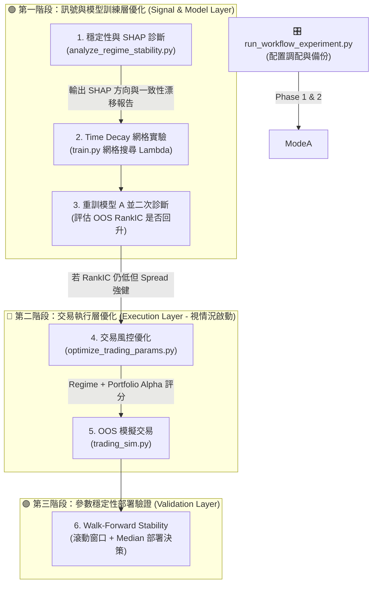

# 🎛️ run_workflow_experiment.py 使用說明與技術架構指南 (2026/06 升級版)

本指南詳細介紹 `run_workflow_experiment.py` 腳本的設計理念、雙階段研發沙盒流程、指標判讀原則，以及如何在系統升級後進行交易與訊號優化。

---

## 🎯 1. 核心設計理念：雙階段沙盒實驗

為了防止量化策略因**前視偏差 (Lookahead Bias)** 與**過擬合 (Overfitting)** 在實盤中失效，本系統實現了**雙階段時光機沙盒實驗**：

*   **🟢 模式 A (研究模式 - 乾淨樣本外)**：
    將時光倒回 `2025-08-01`。我們在 `2025-08-01` 之前的數據上調參並訓練模型，隨後在 `2025-08-02 ~ 2026-06-05` 這段未知的「超級牛市」中進行回測，驗證策略在全新市場環境下的泛化防禦力。
*   **🔵 模式 B (生產模式 - 全數據滾動)**：
    模型滾動重訓至最新日期。風控優化器在全週期上進行 Walk-Forward 最佳化，調整出最契合當前大波動行情的黃金避險參數，防止在牛市中避險過度敏感而被輕易洗出場。

---

## 🔌 2. 系統調用與三階段研發流程圖

量化升級的核心順序為：**先優化模型訊號層（定位與處理漂移），再優化交易執行層，最後進行 Walk-Forward 穩定性驗證。**



---

## 📝 3. 執行參數與命令列選項 (CLI Options)

| 短參數 | 長參數 | 類型 | 預設値 | 說明 |
| :--- | :--- | :--- | :--- | :--- |
| `-f` | `--factor_trials` | `int` | `400` | 模式 A 中 `optimize_factors.py` 的最大搜尋輪數。 |
| `-t` | `--trading_trials` | `int` | `400` | 模式 A / 模式 B 中風控調參的最大搜尋輪數。 |
| `-c` | `--capital` | `int` | `2000000`| 模擬交易與風控調參時的初始資金量。 |
| `--skip_factor_opt` | ❌ | `bool`| `False` | 模式 A 中是否跳過因子調參，直接沿用現有的 `configs/best_factors.json`。 |
| `--fresh` | ❌ | `bool`| `False` | 強制重新執行所有步驟，忽略現有的 Checkpoint 與中間 JSON 檔。 |

---

## 🔍 4. 詳細執行步驟與數據載入

### 📂 步驟 1：安全備份與初始化
*   將 [config.py](config.py)、`configs/best_factors.json` 和 `configs/best_trading_params.json` 備份為 `.workflow.bak` 檔，確保程式不論因何種原因中斷，都能在結束時 100% 還原主系統的狀態。

---

### 🟢 步驟 2：模式 A (研究模式) 運行

#### 2.1 訊號與 SHAP 穩定性診斷 (Step 1 & 1.5 - 核心必跑項目)
*   **調用指令**：`python scripts/analyze_regime_stability.py`
*   載入模型與 OOS 數據，利用 LightGBM 內建之 `predict(..., pred_contrib=True)` 計算特徵的 SHAP 值。
*   輸出 **SHAP Drift 報告**（絕對值 + 方向均值）與 **Feature Importance 一致性對比表**（Gain vs Split vs SHAP），定位真正發生市場機制反轉（MR 轉 Momentum）的因子。

#### 2.2 Time Decay 網格實驗與模型重訓 (Step 2 & 3)
*   **調用指令**：在 [scripts/train.py](scripts/train.py) 中，對時間衰減係數 $\lambda \in [0.0, 0.001, 0.002, 0.003, 0.005]$ 進行網格搜尋。
*   比較不同 $\lambda$ 模型在 OOS 區間的 `RankIC`、`Top1% Alpha` 與 `LS Spread`，挑選最佳 $\lambda$。
*   **注意**：此階段暫不引入任何 `regime_weight` 訓練加權，避免風格追逐（Regime Chasing）與半前視偏差。
*   使用最優 $\lambda$ 重訓模型 A，並跑二次診斷評估 OOS RankIC 是否回升。

#### 2.3 交易風控參數優化 (Step 4 & 5 - 視情況啟動)
*   **調用指令**：`python scripts/optimize_trading_params.py -t <trials> -s 2021-01-02 -e 2025-08-01 -c <capital>`
*   **Regime-based Objective**：將歷史按市況分組評分，天數權重採平方根歸一化：
    $$\text{Combined Score} = \frac{\sum W_r \cdot S_r}{\sum W_r}$$
    其中 $W_r = \min(1.0, \sqrt{N_r/60})$，解決小樣本市況（如 Bull 僅 4 天）的噪訊問題。
*   **Portfolio Alpha Capture**：目標評分函數權重為組合 Alpha（0.6）、組合 Spread（0.2 - 輔助指標）與 Calmar 比率（0.2）。

#### 2.4 Walk-Forward Stability 部署驗證 (Step 6)
*   新增 `--walk_forward` 模式，在 4 個滾動時間窗口下調參。
*   **部署決策原則**：**嚴禁採用 Mean 作為部署值**。必須計算並輸出參數的 `Median（中位數）`、`IQR（四分位距）` 與 `CV（變異係數）`，並**以 Median 作為最終系統部署值**。

---

## 📊 5. 如何判讀實驗報告與診斷結論

實驗結束後，請打開報告檔 `reports/workflow_experiment_report.md`，對照以下原則評估系統健康度。

### 5.1 訊號診斷指標

| 指標 | 健康範圍 | 警示值 | 說明與量化研究原則 |
| :--- | :--- | :--- | :--- |
| **IS All RankIC** | > 0.03 | < 0.01 | 因子對歷史數據的擬合預測力。 |
| **OOS All RankIC** | > 0.02 | < 0.00 | 越接近 0 代表選股排序能力完全失效。 |
| **OOS Top 1% Alpha** | > +0.5%/日 | < 0.00%/日 | 組合超額回報能力，0.5% 以上即為健康。 |
| **CV（變異係數）** | < 0.15 | > 0.30 | 超過 0.30 代表該風控參數在不同窗口極度不穩定，不可信賴。 |

---

### 5.2 核心量化研究診斷原則

#### 1. 區分「Alpha 衰退」與「模型失效」
*   當 OOS RankIC 較 IS 有所下降（例如從 0.044 降到 0.027）時，這是量化策略進入樣本外時正常的衰退現象。
*   只有當 RankIC 接近 0、多空價差（Spread）接近 0 且 t-stat $< 2$ 時，才定義為模型失效。切忌在策略僅僅是賺錢效率下降時，就盲目推翻重構。

#### 2. 利用 SHAP 均值方向定位偏見反轉
*   如果某因子（如 `ret1`）的絕對值 `SHAP (Abs)` 維持穩定或上升，但方向性 `SHAP (Mean)` 的正負號發生反轉（如從 $-0.012$ 變為 $+0.009$），這是市場從 **Mean Reversion 到 Momentum** 機制轉換的鐵證。
*   這代表模型在訓練集學到的規則在 OOS 產生了偏見。這也是我們第一優先進行 **Step 2 (Time Decay Experiment)** 的根本原因。

---

## 🔧 6. OOS 績效不佳的診斷與調整流程

當 OOS 回測績效不佳時，請打開 `reports/backtest_trades_*.csv` 與 SHAP Drift 報告進行分層定位：

```
                        [開始診斷 OOS 表現]
                                │
                 ┌──────────────┴──────────────┐
                 ▼                             ▼
       【第一優先：診斷訊號與模型層】          【第二優先：診斷交易執行層】
                 │                             │
       觀察 SHAP Drift & Consistency,          觀察交易明細，看是否因為
       看是否有高 Gain 因子方向反轉？          避險紅燈太頻繁觸發 (現象 A)
                 │                             或停損太緊 (現象 B)？
                 ▼                             ▼
       [調整模型訓練層 (Step 2/3)]             [調整交易執行層 (Step 4/5/6)]
       進行 Time Decay 網格搜尋，              優化 Regime-based Objective，
       調整 Lambda 加強近期樣本學習；          放寬停損線與移動止盈，
       若方向連續 6 個月一致，再上             並以 Walk-Forward Median 部署。
       regime weights。
```

---

*本說明文件為系統研發指南，最後更新時間：2026-06-07*
